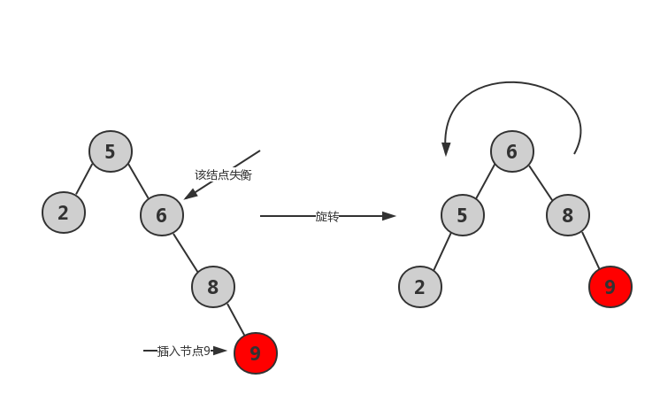

# 二叉查找树
二叉查找树是一种特殊的二叉树，有以下几个特征：
1. 左子树上的所有结点的值都小于或等于它的根结点的值。
2. 右子树上的所有节点的值都大于或等于它的根结点的值。
3. 左右子树分别也都是二叉查找树。

顾名思义，二叉查找树是用来“查找”的，那么他是如何查找的呢？其实就是从根节点开始，根据二叉查找树的（1）和（2）性质，决定进入左子树或者右子树，然后一直往下查找，直到找到待找的元素。

这种查找的模式与二分法有着相似之处，插入和查找的时间复杂度均为 O(logn).

但是普通的二叉查找树会有特殊情况，当顺序插入结点时，二叉查找树可能会退化成具有 n 个结点的线性链表，这时最坏情况，插入和查找的时间复杂度都是 O(n).

## 平衡二叉查找树
为了解决这种可能会退化的情况，出现了一种能够在任何顺序插入元素时，都能保持树的高度较小的二叉查找树，我们称之为 **平衡二叉查找树（Self-balancing Binary Search Tree）**。

实现了 平衡二叉查找树 的数据结构有很多种，例如：
* 2-3 树
* AVL 树
* 红黑树

下面我们介绍一下 AVL树 和 红黑树。

## AVL树
AVL树 这个名字取自它的两位发明者（**A**delson-**V**elsky and **L**andis），它是首个被发明的 自平衡二叉查找树，是在 1962 年的论文 “An Algorithm for the organization of information" 中被提出的。

我们先来看看 AVL树 的定义。

首先我们定义 节点X 的**平衡因子（balence factor）** ：`BF(X) = Height(X的右子树) - Height(X的左子树)`

如果二叉查找树中的所有结点 X 都满足 `BF(X) = {-1, 0, 1}`，那么这个二叉查找树被称为 AVL树。

用通俗的话讲 AVL树：它是一棵空树或者它的左右两个子树的高度差的绝对值不超过 1，并且左右两子树都满足 AVL树的性值。

AVL树 中定义了旋转操作，当某个结点的平衡因子大于等于2时，AVL树会旋转来调整树的结构，来重新满足 平衡因子小于2 的要求。

AVL树只有在插入或者删除结点时，可能会造成失去平衡，需要旋转的情况，而且 只有在那些 插入/删除 结点到根结点的路径上的结点有可能出现失衡，因为只有那些结点的子树结构发生了变化。

当插入新结点导致不平衡时, 我们需要找到距离新节点最近的不平衡结点为轴来转动AVL树来达到平衡。下面分四种情况介绍。

### 左子树的左子树插入结点（左左）

### 右子树的右子树插入结点（右右）

### 左子树的右子树插入结点（左右）

### 右子树的左子树插入结点（右左）

## 红黑树
红黑树在二叉查找树的基础上增加了着色和相关的性质，使得红黑树在无论怎么插入元素时，可以达到**相对平衡**的状态，从而保证了红黑树的查找、插入、删除的时间复杂度最坏为 O(logn)，加快检索效率。

红黑树必须满足 5 条性质
1. 每个结点都是红色或者黑色的。
2. 根结点必须是黑色的。
3. 每个叶子结点（NIL 或者 空结点）都是黑色的，即叶子结点不存储数据。
4. 每个红色结点的两个子结点都是黑色的。
5. 从任一结点到其每个叶子的所有路径都包含相同数目的黑色结点。

下图是一个典型的红黑树

对于红黑树来说，插入和删除操作可能会导致红黑树的某些性质被违背，因此可能需要 **变色** 和 **旋转** 操作来恢复相关性质。

恢复红黑树的性质需要 O(logn) 的变色操作 和 不超过三次（插入操作不超过两次）的旋转操作。所以总体来说，插入和删除操作虽然复杂，但是最坏的时间复杂度仍然保持在了 O(logn)。

### AVL树 与 红黑树
红黑树是“近似平衡”的。红黑树相比avl树，在检索的时候效率其实差不多，都是通过平衡来二分查找。但对于插入删除等操作效率提高很多。红黑树不像avl树一样追求绝对的平衡，他允许局部很少的不完全平衡，这样对于效率影响不大，但省去了很多没有必要的调平衡操作，avl树调平衡有时候代价较大，所以效率不如红黑树。

AVL树是一种高度平衡的二叉树，所以查找的非常高，但是，有利就有弊，AVL树为了维持这种高度的平衡，就要付出更多代价。每次插入、删除都要做调整，就比较复杂、耗时。所以，对于有频繁的插入、删除操作的数据集合，使用AVL树的代价就有点高了。

红黑树只是做到了近似平衡，并不严格的平衡，所以在维护的成本上，要比AVL树要低。
所以，红黑树的插入、删除、查找各种操作性能都比较稳定。对于工程应用来说，要面对各种异常情况，为了支撑这种工业级的应用，我们更倾向于这种性能稳定的平衡二叉查找树。