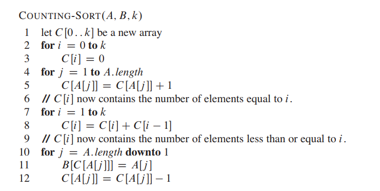
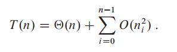

# 排序
讲几个经典的排序，这里我们按是否基于比较来分类：
* 基于比较的排序：插入排序，归并排序，堆排序，快速排序。
* 非基于比较的排序：计数排序，基数排序，桶排序。

下面是摘自网上的一个排序总结表：

讲讲几个线性的，不是基于比较的排序吧。

## 计数排序（Counting sort）
计数排序假设待排序的 n 个元素的取值范围都在 [0, k] 之内。此时排序的时间复杂度是 O（n + k）。（如果 k 也是 O（n）的话，此时会直接说时间复杂度是 O(n)）。

计数排序的关键思想在于：对于输入元素 x，我们要判断小于 x 的元素个数。判断出这个值后，就可以容易地直接将 x 插入数组了。例如，如果有 17 个元素小于 x，那么 x 就要放在第 18 位。
（当然，为了处理有元素的值相同的情况，我们还要对策略做一点小小的处理。）

在伪代码中，我们假设输入的待排序数组是 A[1...n]，A 的长度是 n。

此外，我们需要两个辅助数组，B[1...n] 用来存放结果， C[0...k] 用来存放元素的出现次数。伪代码如下：

在第 5 行后，C 数组中存放的就是每个元素的出现次数了。第 7-8 行将出现次数进行依次相加，对于每个元素来说，就得到了小于等于它的元素个数。

最后，在第 10-12 行中，我们将 A 中的每个元素插入到其在 B 中应该出现的正确位置。
* 之所以在第 12 行会对 C[A[j]] 进行自减，是因为考虑到重复元素的情况，要对每个重复元素予以正确位置
* 之所以在第 10 行从后往前遍历，是为了保证排序的稳定性。

## 基数排序（Radix sort）
基数排序是一种非比较型整数排序算法，其原理是将整数按位分割成不同的数字，然后按照每个位数进行比较。
> 由于整数也可以表达字符串（比如名字或日期）和特定格式的浮点数，所以基数排序也不是只能使用于整数。基数排序的发明可以追溯到 1887 年赫尔曼·何乐礼在打孔卡片制表机（Tabulation Machine）上的贡献。

它是这样实现的：将所有待比较数值（正整数）统一为同样的数位长度，数位较短的数前面补零。然后，从最低位开始，依次进行一次排序。这样从最低位排序一直到最高位排序完成以后，数列就变成一个有序序列。

以下是一个 3 位的正整数之间的基数排序过程：

基数排序的过程，用伪代码表示如下：

注意：在使用基数排序的时候，必须从最低位排到最高位，这样“由轻到重”，最后才能得到对的结果。
> 当使用从最高位到最低位的时候，也不是不行，只不过每次排完序后需要一个 bucket 存储位数值相同的元素，在接下来的比较中，只比较 bucket 内部的元素，而 bucket 之间的顺序不变才行。

因为对于每一位，我们可以考虑使用上面提到的计数排序 O(n + k) ，所以基数排序的时间复杂度为 O(d(n + k)).

## 桶排序
桶排序工作的原理是将数组分到有限数量的桶子里。每个桶子再个别排序（有可能再使用别的排序算法或是以递归方式继续使用桶排序进行排序）。桶排序是鸽巢排序的一种归纳结果。当要被排序的数组内的数值是均匀分配的时候，桶排序使用线性时间（Θ（n））。但桶排序并不是 比较排序，他不受到 O(n log n) 下限的影响。

我们通常通过将排序元素整除的方式来将其较为均匀的放置桶中。例如对于 `8 5 22 15 28 9 45 42 39 19 27 47 12` 这个待排序数组，假设放入桶编号的规则为 `n/10`。这样首先各个元素就可以直接通过整除的方式放置对应桶中，而且右边桶内数据都比左边桶内的大。

在刚刚放入桶中的时候，各个桶的大小相对可以确定，右侧都比左侧大，但桶内还是无序的，对各个桶内分别进行排序，再依次按照桶的顺序、桶内序列顺序得到一个最终排序的序列。

这个方法看起来挺简单的，就是听起来不那么踏实。那么桶排序的时间复杂度到底是多少呢？

这里我们看算法导论，推出结果为 O（n）。推导过程比较复杂，我们简单了解下。

首先我们知道，桶排序分为两个阶段：
1. 将各元素入桶。这个过程的时间复杂度是 O(n).
2. 桶内各个元素进行排序。

假设每个桶内的元素的个数为 n_i，桶内使用插入排序，那么桶排序的时间复杂度可以表示为：

然后继续推导，最终得到复杂度为 O(n)。具体看算法导论吧！
