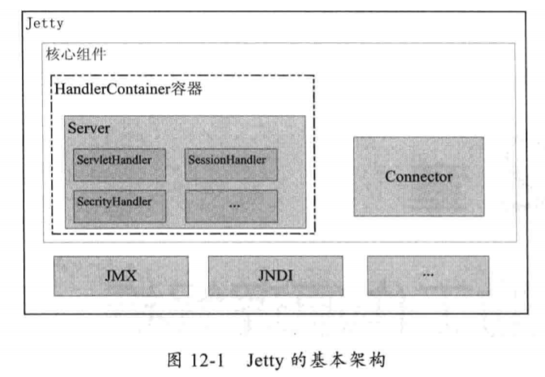

# Jetty
这里以 Jetty 8.2 为例，介绍 Jetty 的模型。

Jetty 的架构如下图所示



Jetty 的主类是 `org.eclipse.jetty.server.Server`. 看一下里面的关键字段和方法
```java
public class Server extends HandlerWrapper implements Attributes
{
    // Server 使用的线程池
    private ThreadPool _threadPool;
    // connector 是用来接受 HTTP 请求的连接器
    //一个 Server 可以有多个 connector，可以理解为能够监听多个端口，但是他们是共用一个线程池的
    private Connector[] _connectors;

    // 构造方法，port代表需要监听的端口
    public Server(int port)
    {
        setServer(this);
        // 初始化 SelectorChannelConnector，（内部创建了一个 SelectorManager，并加入了 bean 列表中）
        // SelectChannelConnector 是一个 NIO 的连接器，说明 Jetty 从这时就已经支持并且默认是 NIO 模型了
        // 与之对应的，有 BIO 的连接器，类名称是 SocketConnector，后面可以做对比
        Connector connector=new SelectChannelConnector();
        connector.setPort(port);
        setConnectors(new Connector[]{connector});
    }

    @Override
    protected void doStart() throws Exception {
        ...
    }
```

从上面的关键信息可以看出，如果要开启一个 Jetty 服务器，可以使用类似以下的写法
```java
Server server = new Server(8080);
server.start();
// 调用的是父类 AbstractLifeCycle 的 start 方法，最后会调到 Server 的 doStart 里
```

接下来看看 Server 的 doStart 里到底做了什么事情。
```java
protected void doStart() throws Exception {
    // 配置了默认线程池，并加入了 Server 维护的 bean 列表中
    if (_threadPool==null)
        setThreadPool(new QueuedThreadPool());

    try
    {
        // 调用了所有 bean 的 start 方法（包括上面的线程池，所以这一步启动了 Server 的线程池）
        super.doStart();
    }
    ...
    // 调用了所有 connecotr 的 start 方法
    if (_connectors!=null && mex.size()==0)
    {
        for (int i=0;i<_connectors.length;i++)
        {
            try{_connectors[i].start();}
            catch(Throwable e)
            {
                mex.add(e);
            }
        }
    }
    ...
}
```
可以看出，其实就是调用了每个 connector 的 start 方法。而上面的构造函数可以看出，这里的 connector 是一个 `SelectorChannelConnector` ，所以接下来看 `SelectorChannelConnector` 的 start 方法.

```java
//AbstractConnector.java
protected void doStart() throws Exception
{
    if (_server == null)
        throw new IllegalStateException("No server");

    // open listener port。这里调用的就是 SelectChannelConnector 的 open() 方法
    // 调用完后，就已经开始监听目标端口了
    open();

    // 把 server 的线程池直接拿过来用，这也应证了上面说的一个 Server 内的 connector 共用线程池
    if (_threadPool == null)
    {
        _threadPool = _server.getThreadPool();
        // 把线程池加入该 connector 维护的 bean 列表中
        addBean(_threadPool,false);
    }

    // 内部其实是调用了每个 bean 的 start 方法，有两个关键的 bean
    // 一个是上面上面刚刚加入的那个线程池的(不过如果是从 server 拿的线程池，那么已经是开启状态了，内部逻辑保证不会重复开启)
    // 一个是构造函数时加入的 ConnectorSelectorManager（调用它的 start，主要是开启了 selector 线程，也就是从线程池中拿一个线程出来当 selector 线程）
    super.doStart();

    synchronized (this)
    {
        // getAcceptors 默认返回1，所以这里是创建了一个长度为1的线程数组
        _acceptorThreads = new Thread[getAcceptors()];

        // 为线程池添加一个 new Acceptor(i) 的任务，该任务会将「执行该任务的线程」变成一个 acceptor 线程
        // 也就是从线程池中拿一个线程出来当 acceptor 线程
        // acceptor 线程的作用就是接受外部请求的TCP连接，然后调用 connector 的 accept  方法进行连接
        for (int i = 0; i < _acceptorThreads.length; i++)
            if (!_threadPool.dispatch(new Acceptor(i)))
                throw new IllegalStateException("!accepting");
        if (_threadPool.isLowOnThreads())
            LOG.warn("insufficient threads configured for {}",this);
    }

    LOG.info("Started {}",this);
}
```

