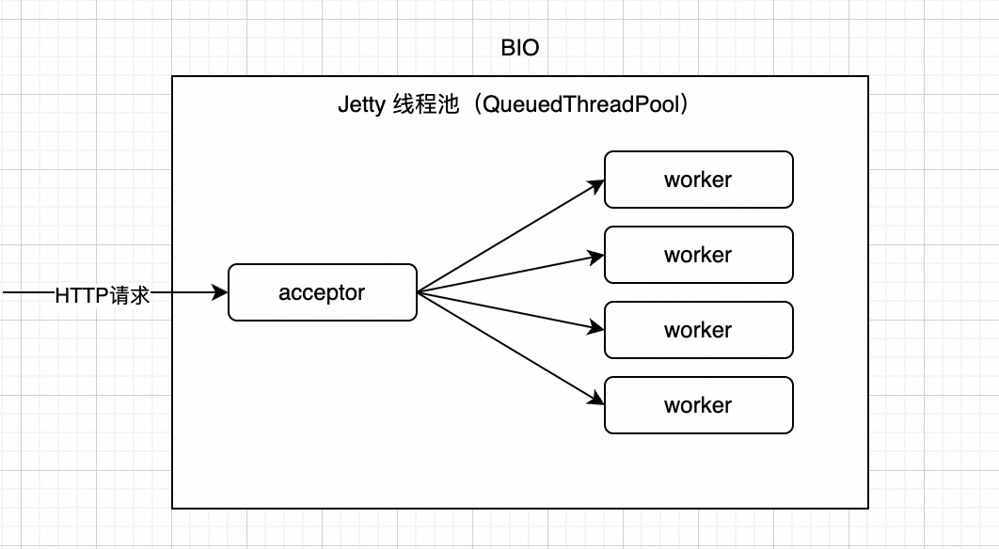
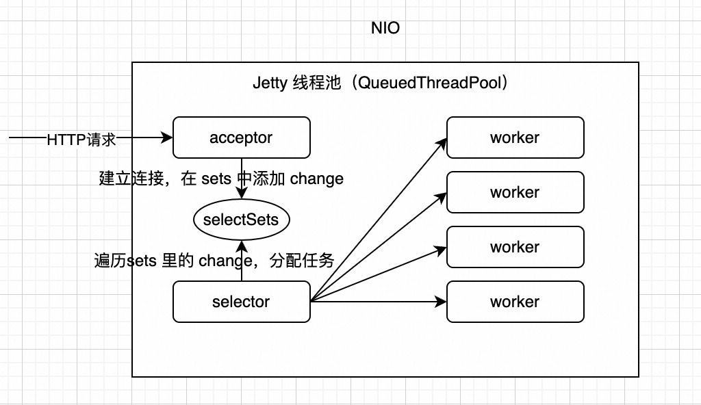

# Jetty
这里以 Jetty 8.2 为例，介绍 Jetty 的模型。


Jetty 的架构如下图所示


可见 Jetty 里的核心组件有 Connector 和 Handler，其中：
* Connector 用于发起 HTTP 监听，并接受外部 HTTP 请求
* Handler 用于处理 HTTP 请求并生成响应

## 如何使用 Jetty
首先看一个最简单的例子，用 Jetty 启用一个 Web 服务器，监听 8080 端口并对请求返回字符串 “Hello World”。

```java
public class HelloWorldServer {

    public static class HelloServlet extends HttpServlet {
        @Override
        protected void doGet(HttpServletRequest req, HttpServletResponse resp)
                throws IOException {
            resp.setContentType("text/html");
            resp.setStatus(HttpServletResponse.SC_OK);
            resp.getWriter().println("<h1>Hello World</h1>");
        }
    }

    public static void main(String[] args) throws Exception {
        Server server = new Server(8080); // 创建 Jetty 服务器，监听 8080 端口
        
        // 创建一个 handler，handler 用于处理请求
        ServletContextHandler context = new ServletContextHandler();
        // 设置上下文路径
        context.setContextPath("/"); 
        // 将 servlet 添加到 Jetty，并映射到路径 "/"
        context.addServlet(new ServletHolder(new HelloServlet()), "/");
        // 将该 handler 配置成 server 的 handler
        // 这里调用的其实是 Server 的 父类 HandlerWrapper 的 setHandler 方法
        server.setHandler(context);


        try {
            server.start(); // 启动 Jetty 服务器
            server.join();  // 在当前线程加入服务器，等待服务器关闭
        } catch (Exception e) {
            e.printStackTrace();
        } finally {
            server.destroy(); // 在服务器关闭时清理资源
        }
    }
}

```

Jetty 的主类是 `org.eclipse.jetty.server.Server`. 看一下里面的关键字段和方法
```java
public class Server extends HandlerWrapper implements Attributes
{
    // Server 使用的线程池
    private ThreadPool _threadPool;
    // connector 是用来接受 HTTP 请求的连接器
    //一个 Server 可以有多个 connector，可以理解为能够监听多个端口，但是他们默认是共用一个线程池的
    private Connector[] _connectors;

    // 构造方法，port代表需要监听的端口
    public Server(int port)
    {
        setServer(this);
        // 初始化 SelectorChannelConnector，（内部创建了一个 SelectorManager，并加入了 bean 列表中）
        // SelectChannelConnector 是一个 NIO 的连接器，说明 Jetty 从这时就已经支持并且默认是 NIO 模型了
        // 与之对应的，有 BIO 的连接器，类名称是 SocketConnector，后面可以做对比
        Connector connector=new SelectChannelConnector();
        connector.setPort(port);
        setConnectors(new Connector[]{connector});
    }

    @Override
    protected void doStart() throws Exception {
        ...
    }
```

## Jetty 启动流程

接下来看看 Server 的 doStart 里到底做了什么事情。
```java
protected void doStart() throws Exception {
    // 配置了默认线程池，并加入了 Server 维护的 bean 列表中
    if (_threadPool==null)
        setThreadPool(new QueuedThreadPool());

    try
    {
        // 调用了所有 bean 的 start 方法（包括上面的线程池，所以这一步启动了 Server 的线程池）
        super.doStart();
    }
    ...
    // 调用了所有 connecotr 的 start 方法
    if (_connectors!=null && mex.size()==0)
    {
        for (int i=0;i<_connectors.length;i++)
        {
            try{_connectors[i].start();}
            catch(Throwable e)
            {
                mex.add(e);
            }
        }
    }
    ...
}
```
可以看出，其实就是调用了每个 connector 的 start 方法。而上面的构造函数可以看出，这里的 connector 是一个 `SelectorChannelConnector` ，所以接下来看 `SelectorChannelConnector` 的 start 方法.

```java
//AbstractConnector.java
protected void doStart() throws Exception
{
    if (_server == null)
        throw new IllegalStateException("No server");

    // 开启端口监听。这里调用的就是实际Connector 的open 方法了。
    // 如果是 NIO 模型，调用的是SelectChannelConnector 的 open() 方法
    // 如果是 BIO 模型，调用的是 Selector 的 open() 方法
    // 调用完后，就已经开始监听目标端口了。后面在讲两种模型时，会具体讲到
    open();

    // 把 server 的线程池直接拿过来用，这也应证了上面说的一个 Server 内的 connector 共用线程池
    if (_threadPool == null)
    {
        _threadPool = _server.getThreadPool();
        // 把线程池加入该 connector 维护的 bean 列表中
        addBean(_threadPool,false);
    }

    // 内部其实是调用了每个 bean 的 start 方法，有两个关键的 bean
    // 一个是上面上面刚刚加入的那个线程池的(不过如果是从 server 拿的线程池，那么已经是开启状态了，内部逻辑保证不会重复开启)
    // 一个是构造函数时加入的 ConnectorSelectorManager（调用它的 start，主要是开启了 selector 线程，也就是从线程池中拿一个线程出来当 selector 线程）
    super.doStart();

    synchronized (this)
    {
        // getAcceptors 默认返回1，所以这里是创建了一个长度为1的线程数组
        _acceptorThreads = new Thread[getAcceptors()];

        // 为线程池添加一个 new Acceptor(i) 的任务，该任务会将「执行该任务的线程」变成一个 acceptor 线程
        // 也就是从线程池中拿一个线程出来当 acceptor 线程
        // acceptor 线程的作用就是接受外部请求的TCP连接，然后调用 connector 的 accept  方法进行连接
        for (int i = 0; i < _acceptorThreads.length; i++)
            if (!_threadPool.dispatch(new Acceptor(i)))
                throw new IllegalStateException("!accepting");
        if (_threadPool.isLowOnThreads())
            LOG.warn("insufficient threads configured for {}",this);
    }

    LOG.info("Started {}",this);
}
```

可以看出，acceptor 线程是从线程池里抽出来的，那么看看 `Acceptor` 类的 run 方法，就知道 acceptor 线程在干什么事情了。（下文讲到的 NIO 和 BIO 模型，都有 acceptor 线程，而且是都是这个 Acceptor）

```java
private class Acceptor implements Runnable {
    public void run()
    {
        Thread current = Thread.currentThread();
        String name;
        synchronized (AbstractConnector.this)
        {
            if (_acceptorThreads == null)
                return;

            _acceptorThreads[_acceptor] = current;
            name = _acceptorThreads[_acceptor].getName();
            // 设置 acceptor 线程的名字，方便识别
            current.setName(name + " Acceptor" + _acceptor + " " + AbstractConnector.this);
        }
        int old_priority = current.getPriority();

        try
        {
            current.setPriority(old_priority - _acceptorPriorityOffset);
            while (isRunning() && getConnection() != null)
            {
                try
                {
                    // 不停调用子类的 accept 方法。
                    // 根据 BIO 或是 NIO，这里会调到不同的子类方法，BIO 是 SocketConnector，NIO 是 SelectChannelConnector
                    accept(_acceptor);
                }
                catch (EofException e)
                {
                    LOG.ignore(e);
                }
                ...
    }
}
```

## Jetty 的 NIO 与 BIO 模型
上面提到，Jetty 默认采用的 NIO 模型，同时也支持较老的 BIO 模型，下面分别讲下这两种模型，以便更好理解区别。

由于 BIO 更简单，首先讲讲 BIO 模型。

### BIO


如上图所示，在 BIO 模型中，Jetty 会将线程池中的一个线程拿出来当成 acceptor 线程，这个线程专门负责接受 HTTP 请求，并建立起 TCP 连接，然后将建立好的连接抛给线程池其他的线程，让他们去处理（包括读取请求数据，处理请求，将响应写入连接等）。
之前在启动流程中讲过，开启监听的关键在 Connector 的 open 方法中。所以首先我们看看 `SocketConnector` 的 open 方法
```java
public class SocketConnector extends AbstractConnector {
    public void open() throws IOException
    {
        // 创建一个 ServerSocket，这是 JDK 自带的一个类，专门用于开启服务端socket监听的
        if (_serverSocket==null || _serverSocket.isClosed())
        _serverSocket= newServerSocket(getHost(),getPort(),getAcceptQueueSize());
        _serverSocket.setReuseAddress(getReuseAddress());
        _localPort=_serverSocket.getLocalPort();
        if (_localPort<=0)
            throw new IllegalStateException("port not allocated for "+this);

    }

    protected ServerSocket newServerSocket(String host, int port,int backlog) throws IOException
    {
        ServerSocket ss= host==null?
            new ServerSocket(port,backlog):
            new ServerSocket(port,backlog,InetAddress.getByName(host));

        return ss;
    }
}
```
然后再看看 `SocketConnector` 的 accept 方法，这是 acceptor 线程会调用到的方法
```java
public class SocketConnector extends AbstractConnector {
    @Override
    public void accept(int acceptorID)
    	throws IOException, InterruptedException
    {
        // 一个阻塞性的accept方法，会阻塞直到建立一条连接
        Socket socket = _serverSocket.accept();
        configure(socket);

        // ConnectorEndpoint 代表一条连接，同时也是一个Runnable的任务
        ConnectorEndPoint connection=new ConnectorEndPoint(socket);
        // dispatch 底层会调用 threadpool 的 dispatch 方法，执行这个任务
        connection.dispatch();
    }
}
```
ConnectorEndpoint 里的具体任务就暂时不细分析了，总之在这个任务里，会执行请求流读取、请求处理及生成响应、响应流写入的完整过程。之所以说这种模式是 BIO 的，就是因为请求到来，连接建立完毕后，这个任务就直接甩给一个工作线程了，由这个工作线程负责所有的读取、处理、写入等。

而我们知道，网络IO（也就是上面说的读取、写入等操作）是比较耗时的，这些时间该工作线程一直在等待，无法干其他的事情，相当于没法用 CPU 了，只是耗着内存。

假设现在有 500 个线程，都处于 IO 过程中，那么这 500 个线程会占用大量内存，而且无法使用 CPU，这无疑是一种资源浪费。如果有更好的办法能够利用起这些线程，让他们在等待 IO 的过程中可以去处理别的事情，等 IO 准备好之后，再回来处理这个请求，无疑会更高效，这也是 NIO 的目的和意义。

### NIO
下面看看 Jetty 的 NIO 模型。架构如下


在 NIO 模型中，Connector 的类就由 `SocketConnector` 变为 `SelectChannelConnector` 了。先看看它的初始化方法
```java
public class SelectChannelConnector extends AbstractNIOConnector {
    private final SelectorManager _manager = new ConnectorSelectorManager();
    public SelectChannelConnector()
    {
        _manager.setMaxIdleTime(getMaxIdleTime());
        // 把初始化好的 manager 放到了 bean 列表里，方便后面执行它的 start 方法
        addBean(_manager,true);
        // 设置 acceptors 数量，后面 acceptor 线程的数量就由它决定
        setAcceptors(Math.max(1,(Runtime.getRuntime().availableProcessors()+3)/4));
    }
}
```
接下来看看它的 doStart 方法
```java
    @Override
    protected void doStart() throws Exception
    {
        // 将 selectSets 值设置为与 acceptor 数量相同
        _manager.setSelectSets(getAcceptors());
        _manager.setMaxIdleTime(getMaxIdleTime());
        _manager.setLowResourcesConnections(getLowResourcesConnections());
        _manager.setLowResourcesMaxIdleTime(getLowResourcesMaxIdleTime());
        // 调用 AbstractConnector 的 doStart 方法，在上面讲过了
        super.doStart();
    }
```


开启监听的方法是 `SelectChannelConnector` 的 open 方法
```java
public class SelectChannelConnector extends AbstractNIOConnector {
    public void open() throws IOException
    {
        synchronized(this)
        {
            if (_acceptChannel == null)
            {
                // 创建一个新的 server socket
                // 注意 ServerSocketChannel 是 jdk nio 里的类
                _acceptChannel = ServerSocketChannel.open();
                // 将该 channel 配置成阻塞模式。
                // 也就是说，当执行 _acceptChannel.accept()方法时，会阻塞直到新的连接请求到来
                _acceptChannel.configureBlocking(true);

                _acceptChannel.socket().setReuseAddress(getReuseAddress());
                InetSocketAddress addr = getHost()==null?new InetSocketAddress(getPort()):new InetSocketAddress(getHost(),getPort());
                // 将该 channel 绑定到目标端口上
                _acceptChannel.socket().bind(addr,getAcceptQueueSize());

                _localPort=_acceptChannel.socket().getLocalPort();
                if (_localPort<=0)
                    throw new IOException("Server channel not bound");

                addBean(_acceptChannel);
            }
        }
    }
}
```
需要重点关注这个 `_acceptChannel.configureBlocking(true);` ，理解下这里的阻塞模式：
* 当传递 true 时，这个通道将被配置为阻塞模式。这意味着任何试图在这个通道上进行 I/O 操作的线程会被阻塞直到操作完成。就 ServerSocketChannel 而言，accept() 方法（这个方法接受并返回新的连接）将会阻塞，直到新的连接到达或被其他方式中断。在阻塞模式下，ServerSocketChannel 的行为和传统的 ServerSocket 很相似。
* 如果传递 false，通道将被配置为非阻塞模式。在这种模式下，调用 accept() 方法将立即返回，如果还没有新的连接，则返回 null。这允许服务器在单个线程中管理多个通道，即所谓的非阻塞 IO 或多路复用 IO。

上述代码执行后，目标端口就已经成功开始监听了，也可以理解为服务器启动了。接下来是启动 selector 线程和 acceptor 线程。
启动 selector 的线程在 `ConnectorSelectorManager` 的 start 方法里
```java
// SelectorManager
protected void doStart() throws Exception
{
    // selectSets 值与 acceptor 数量相同
    _selectSet = new SelectSet[_selectSets];
    for (int i=0;i<_selectSet.length;i++)
        _selectSet[i]= new SelectSet(i);

    super.doStart();

    // 开启相应数量的 selector 线程
    for (int i=0;i<getSelectSets();i++)
    {
        final int id=i;
        boolean selecting=dispatch(new Runnable()
        {
            public void run()
            {
                String name=Thread.currentThread().getName();
                int priority=Thread.currentThread().getPriority();
                try
                {
                    SelectSet[] sets=_selectSet;
                    if (sets==null)
                        return;
                    SelectSet set=sets[id];

                    Thread.currentThread().setName(name+" Selector"+id);
                    if (getSelectorPriorityDelta()!=0)
                        Thread.currentThread().setPriority(Thread.currentThread().getPriority()+getSelectorPriorityDelta());
                    LOG.debug("Starting {} on {}",Thread.currentThread(),this);
                    while (isRunning())
                    {
                        try
                        {
                            // selector 线程的任务，就是不停执行 set.doSelect() 方法
                            set.doSelect();
                        }
                        catch(IOException e)
                        {
                            LOG.ignore(e);
                        }
                        catch(Exception e)
                        {
                            LOG.warn(e);
                        }
                    }
                }
                finally
                {
                    LOG.debug("Stopped {} on {}",Thread.currentThread(),this);
                    Thread.currentThread().setName(name);
                    if (getSelectorPriorityDelta()!=0)
                        Thread.currentThread().setPriority(priority);
                }
            }

        });

        if (!selecting)
            throw new IllegalStateException("!Selecting");
    }
}
```
selector 线程的工作就是不停执行 `set.doSelect()` 方法，而这个方法非常长。。详情可以看 `org.eclipse.jetty.io.nio.SelectorManager.SelectSet#doSelect` ，不展开了，其作用可以总结为：
1. 设置当前选择器线程：标记当前的 _selecting 线程为处理选择器事件的线程。
2. 确认选择器状态：检查传入的选择器 selector 是否为 null，如果是，则直接返回。
3. 处理变更队列：处理 _changes 队列中的所有更改，这可能包括注册新的通道，更新已有的 EndPoint，或执行其他任务。这要求代码处理队列中的对象，这些对象可能表示新的连接请求、优先级更改等。
4. 执行即时选择：通过调用 selector.selectNow() 执行一个非阻塞的选择操作，立即返回任何就绪的 IO 事件。
5. 处理就绪事件：
如果没有就绪事件，有可能进行了短暂的休眠（如果 _pausing 标志为 true）。
调用 selector.select(wait) 可能会执行一个阻塞的选择操作，等待特定的时间或直到就绪事件出现。
6. 清理和更新选择器状态：检查 _selector 是否已关闭或被销毁，这样循环就会退出。
7. 处理选定的键：遍历 selector.selectedKeys() 集合，并根据每个键表示的 IO 事件采取相应的行动。校验键是否有效，并取消无效的键。处理可读、可写或连接完成的事件。
8. 调度超时任务：检查任何等待执行或已到期的超时任务，并执行它们。
9. 心跳和空闲处理：
如果到了心跳时间，执行心跳检查，检查非活动的 EndPoint。
用于决定选择器是否过于忙碌，并可能决定引入休眠来减少 CPU 利用率。
10. 清除处理的键：清理处理过的选择键，为下一轮选择事件准备。
11. 忙碌选择监控器重置：重置忙碌选择数和暂停标志，以准备下一次监控周期。
12. 异常处理：捕获异常，根据服务器运行状态决定是否记录日志，并且确保相关通道被关闭。
13. 结束清理：清除 _selecting 的引用，表明选择器处理循环结束。

总之，`doSelect` 做的事情就是遍历所有 changes，找到可以处理的任务并进行分配。

而这里的 changes 是哪里来的呢，主要来源就是 acceptor，下面会讲。

接下来看看 `SelectChannelConnector` 的 `accept` 方法，也就是 acceptor 线程执行的代码
```java
public void accept(int acceptorID) throws IOException
{
    ServerSocketChannel server;
    synchronized(this)
    {
        server = _acceptChannel;
    }

    if (server!=null && server.isOpen() && _manager.isStarted())
    {
        // 调用 accept 方法，接受新请求，建立连接，连接对应一个 SocketChannel
        SocketChannel channel = server.accept();
        // 这个具体的 channel，需要配置为非阻塞模式
        channel.configureBlocking(false);
        Socket socket = channel.socket();
        configure(socket);
        // 调用 SelectorManager 的 register 方法，将该 channel 注册进去
        _manager.register(channel);
    }
}
```

下面看下 SelectorManager 的 register 方法
```java
public void register(SocketChannel channel)
{
    // 类似轮训的方式，找到一个合适的 s
    int s=_set++;
    if (s<0)
        s=-s;
    s=s%_selectSets;
    SelectSet[] sets=_selectSet;
    if (sets!=null)
    {
        // 在 sets[s] 中添加 change，这里的 change 实际类型就是 SocketChannel
        SelectSet set=sets[s];
        set.addChange(channel);
        set.wakeup();
    }
}
```
也就是说，accept 做的事情其实就是建立连接，然后吧 socketChannel 加入到对应 set 的 change 列表中，就完了。

是 selector 遍历 set 里面的 change，然后进行处理和任务分配的。

接下里可能会有一个疑问：selector 把任务分配给工作线程之后，工作线程在处理任务的时候，如果碰到了 IO（例如网络请求等），会怎么处理呢？如果还是像传统的方式一样调用阻塞式的 IO 操作，那么工作线程还是会阻塞住，没法干别的事情，所以这里我们需要调用非阻塞式的 IO 操作，例如 Servlet 3.0 提出来的 `AsyncContext` 模式，或者在早期 Jetty 使用的 Continuation 模式。

下面通过 Servlet 3.0 提出的 `AsyncContext` 介绍一下非阻塞式 IO 的处理方式。假设我们要用 Jetty 写一个简易的网关程序，也就是说 Jetty 服务端在接受到请求后，需要往后端服务转发请求，这个往后端服务转发的过程显然是一个重 IO 的操作，它很可能比较耗时，因此我们希望它可以异步进行，不占用 Jetty Server 的工作线程，那么我们需要如下实现

```java
public class SimpleGateway {
    public static void main(String[] args) throws Exception {
        // 初始化一个 Jetty Server，监听 8082 端口
        Server server = new Server(8082);
        // 设置处理器
        server.setHandler(new RequestHandler());
        server.start();
        server.join();
    }
}

public class RequestHandler extends AbstractHandler {
    private final static Logger log = Logger.getLogger(RequestHandler.class.getName());


    private final HttpClient httpClient = new HttpClient();

    public RequestHandler() throws Exception {
        httpClient.start();
    }

    @Override
    public void handle(String target, Request baseRequest, HttpServletRequest request, HttpServletResponse response) throws IOException, ServletException {
        if (baseRequest.isHandled()) {
            return;
        }
        // 将当前请求设置为异步处理. 调用完该方法之后，即使 handle 方法结束，该请求的响应也不会被提交，直到调用 asyncContext.complete() 方法为止
        final AsyncContext asyncContext = baseRequest.startAsync();
        baseRequest.setHandled(true);

        // 根据实际情况配置后端服务 URI
        String backendServiceUri = "http://httpbin.org/get";
        //会打印 Handle Request Thread: qtp1146743572-27，是 server 创建的线程池里的线程，也就是上面图中画的工作线程 worker
        log.info("Handle Request Thread: " + Thread.currentThread().getName());
        // httpClient 这里是异步调用，为非阻塞，所以会立即返回，对响应的处理在回调函数里进行
        httpClient.newRequest(backendServiceUri)
                .method(HttpMethod.GET)
                .send(new BufferingResponseListener() {
                    @Override
                    public void onComplete(Result result) {
                        // 这里面的逻辑都属于回调函数，是在 httpClient 内置的线程池里进行的
                        try {
                            if (result.isSucceeded()) {
                                Response backendResponse = result.getResponse();
                                byte[] responseContent = getContent();

                                // 设置响应码和内容类型
                                response.setStatus(backendResponse.getStatus());
                                response.setContentType(backendResponse.getHeaders().get("Content-Type"));
                                // 将后端服务的响应发送给原始请求客户端
                                response.getOutputStream().write(responseContent);
                            } else {
                                response.setStatus(HttpStatus.BAD_GATEWAY_502);
                                result.getFailure().printStackTrace();
                            }
                        } catch (IOException e) {
                            e.printStackTrace();
                        } finally {
                            // 会打印 Execute IO Thread: HttpClient@3339ad8e-19 ，说明回调是在内部线程池里执行的
                            log.info("Execute IO Thread: " + Thread.currentThread().getName());
                            asyncContext.complete();
                        }
                    }
                });
    }
}
```

