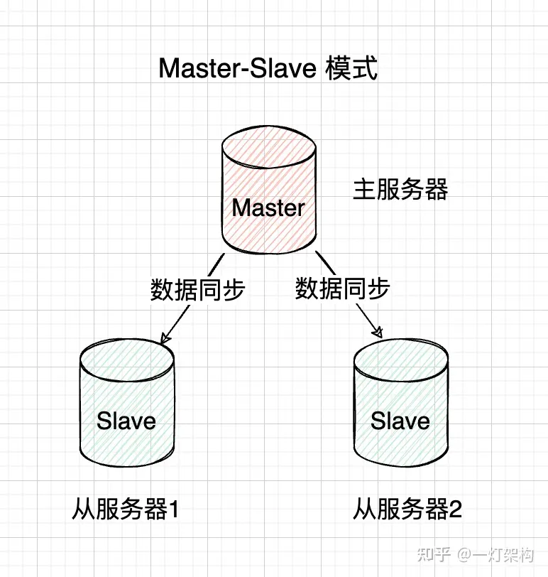
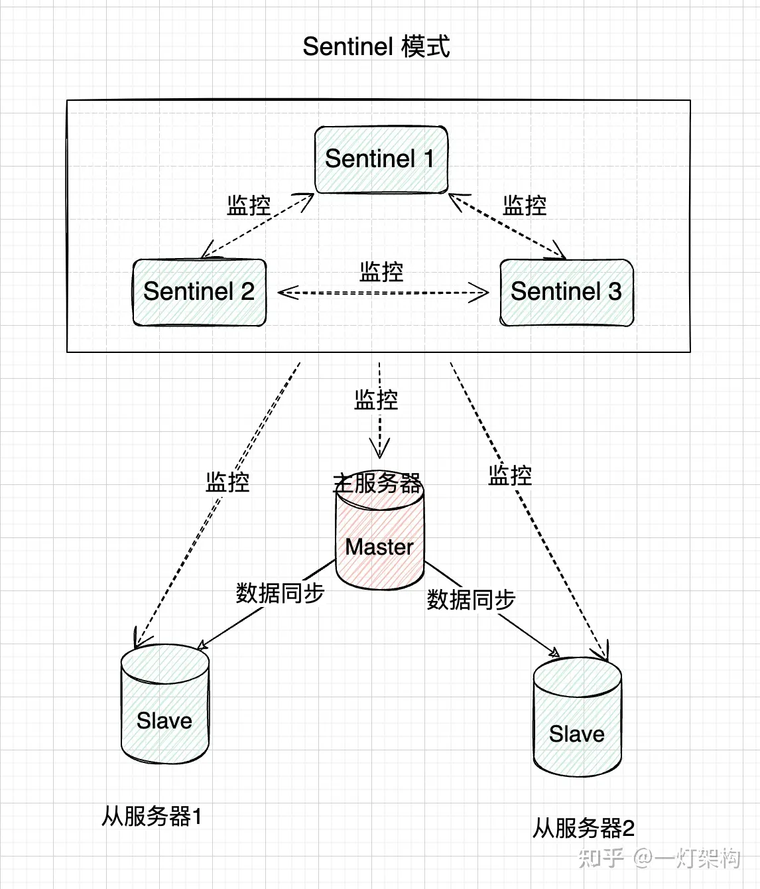

# Redis 集群详解
为了保证 Redis 的高可用，通常不会采用单机模式，而是考虑使用多台机器组成 Redis 集群。

Redis 集群是一种通过将多个 Redis 节点连接在一起以实现高可用性、数据分片和负载均衡的技术。它允许 Redis 在不同节点上同时提供服务，提高整体性能和可靠性。根据搭建的方式和集群的特性，Redis 集群主要有三种模式：主从复制模式（Master-Slave）、哨兵模式（Sentinel）和 Cluster 模式。

使用 Redis 集群模式的优点：
1. 高可用：Redis 集群可以在某个节点发生故障时，自动进行故障转移，保证服务的高可用。
2. 负载均衡：Redis 集群可以将客户端请求分发到不同的节点上，有效分担节点的压力，提高系统的整体性能。
3. 容灾恢复：通过主从复制或哨兵模式，Redis 集群可以在主节点出现故障时，快速切换到从节点，实现业务的无缝切换
4. 数据分片：在 Cluster 模式下，Redis 集群可以将数据分散在不同节点上，从而突破单节点内存限制，实现更大规模的数据存储
5. 易于扩展：Redis 集群可以根据业务需求和系统负载，动态添加或移除节点，实现水平扩展。

## 主从复制模式
主从复制模式最大的优点就是简单，最少两个节点就可以组成主从模式，并且可以通过读写分离来避免读和写同时不可用。不过，在这种模式种，一旦 Master 节点出现故障，主从节点无法自动切换，直接导致写不可用。

所以，主从模式一般适合业务发展初期，并发量低，运维成本低的情况。



### 使用方式
使用主从节点的方式如下：
1. 配置主节点：在主节点的 `redis.conf` 文件中，无需特殊配置，主节点默认监听所有客户端请求
```
# 主节点默认端口号 6379
port 6379
```

2. 配置从节点：在从节点的 `redis.conf` 文件中，添加如下配置，指定主节点的地址和端口
```
# 从节点默认端口号 6379
port 6379

# replicaof 主节点IP 主节点端口
replicaof xxx.xxx.xx.xx 6379
```

3. 验证主从复制：在主节点上执行写操作，然后在从节点上进行读操作，检查数据是否一致。

### 优缺点
主从模式的优点：
1. 配置简单，易于实现
2. 实现数据冗余，提高集群的可靠性
3. 客户端可以使用读写分离的方式来访问，提高系统性能

缺点：
1. 主节点故障时，需要手动切换到从节点，故障恢复时间较长
2. 主节点承担所有写操作，可能成为性能瓶颈
3. 无法实现数据分片，受单节点内存限制

## 哨兵模式
哨兵模式时在主从模式的基础上加入了哨兵节点，实现了自动故障转移。哨兵节点是一种特殊的 Redis 节点，它会监控主节点和从节点的运行状态。当主节点发生故障时，哨兵节点会自动从从节点中选出一个新的主节点，并通知其他从节点和客户端，实现故障转移。


### 使用方式
1. 配置主从复制：首先按照主从复制的方式，搭建一个主从复制集群（上面讲过）
2. 配置哨兵节点：在哨兵节点上常见一个新的哨兵配置文件（如 sentinel.conf），并添加如下配置
```
# sentinel节点端口号
port 26379

# sentinel monitor 被监控主节点名称 主节点IP 主节点端口 quorum
sentinel monitor mymaster 127.0.0.1 6379 2

# sentinel down-after-milliseconds 被监控主节点名称 毫秒数
sentinel down-after-milliseconds mymaster 60000

# sentinel failover-timeout 被监控主节点名称 毫秒数
sentinel failover-timeout mymaster 180000
```
其中：
* quorum 是指触发故障转移所需的最小哨兵节点数。
* down-after-milliseconds 是指主节点被判断为失效的时间
* failover-timeout 是故障转移超时时间。

为什么只配置了主节点的地址，没有配置从节点？因为通过主节点，可以找到从节点，例如通过在主节点执行 `INFO REPLICATION` 命令，可以查看其连接的从节点。

为什么没有配置其他的哨兵地址？Sentinel 只要连接上 redis master 节点，就可以发现连接该 master 的其他 Sentinel，具体发现过程：
1. Sentinel 启动时：每个 Sentinel 实例启动时，会订阅由所有监控同一个主服务器的 Sentinel 组成的一个特殊频道 __sentinel__:hello。
2. 发送 Hello 消息：每个 Sentinel 实例会定期（默认为每 2 秒）向 __sentinel__:hello 频道发送一个 hello 消息。该消息包含了该 Sentinel 实例的一些元信息，比如它的 IP 地址、端口以及它知道的关于主节点和其他 Sentinel 的情报。
3. 接受 Hello 消息：当其他 Sentinel 实例收到一个 hello 消息时，它们会解析该消息并学习发送者的存在。如果接收到新的 Sentinel 信息，则会将其加入到本地已知其他 Sentinel 实例列表中。
4. 自我更新和同步：当一个 Sentinel 实例收到包含更多最新信息的 hello 消息时（例如，一些 Sentinel 可能已经感知到主节点的故障），它会更新自己的状态信息，并根据 hello 消息中的数据同步自己的视图。
5. 定期检查：每个 Sentinel 实例也会定期对它已知的其他 Sentinel 实例执行检查，以确认它们是否仍然是活跃的。如果某个 Sentinel 长时间未响应，那么它将被认为已经下线，并从已知的 Sentinel 列表中移除。

Sentinel 通过这种方式确保了整个群体的成员都对彼此有一致的认识，即使在没有中央控制器的情况下。这种自动发现机制增强了 Redis Sentinel 高可用系统的健壮性和可扩展性，因为你可以轻松地通过添加更多的 Sentinel 实例来增加系统的容错能力。

要查看 Sentinel 知道的其他 Sentinel 实例，你可以使用 sentinel sentinels <master-name> 命令。这将列出所有监控给定主节点的 Sentinel 实例及其状态信息。请记住 <master-name> 是你在 Sentinel 配置文件中配置的监控主节点的名称。

### 优缺点
哨兵模式优点：
1. 自动故障转移，提高系统的高可用性
2. 具备主从复制的所有优点，如数据冗余和读写分离

缺点：
1. 配置和管理相对复杂
2. 依然无法实现数据分片，受单节点内存限制。

## 脑裂问题
像上面提到的哨兵模式，因为存在主从切换过程，因此存在脑裂问题。

什么是脑裂问题？是指在主从集群中，同时有两个主节点，它们都能接受写请求，它们之间产生数据不一致，形象称为“脑裂”。脑裂最直接的影响，就是客户端不知道该往哪个主节点写入数据，结果就是不同的客户端会往不同的主节点上写入数据。而且严重的话，脑裂会进一步导致数据丢失。

下面是一个产生脑裂问题的场景

简单来讲，就是主库暂时下线，哨兵开始进行主从切换。在主从切换还未完成的过程中，原主库又好了，等到主从切换结束后，新选择出来的主库和原主库同时存在，就会出现脑裂了。

那么为什么脑裂会导致数据丢失呢？
* 主从切换后，从库一旦升级为新主库，哨兵就会让原主库执行slave of命令，和新主库重新进行全量同步。而在全量同步执行的最后阶段，原主库需要清空本地的数据，加载新主库发送的RDB文件，这样一来原主库在主从切换期间保存的新写数据就丢失了；

脑裂产生问题的本质原因是，Redis 主从集群内部没有通过共识算法，来维护多个节点数据的强一致性。它不像Zookeeper那样，每次写请求必须大多数节点写成功后才认为成功。当脑裂发生时 Zookeeper 主节点被孤立，此时无法写入大多数节点，写请求会直接返回失败，因此它可以保证集群数据的一致性；

从 Zookeeper 的实践中，我们可以推导出 Redis 中解决脑裂问题的办法，下面看。

Redis 中有两个参数配置：
* min-slaves-to-write：设置主库能进行数据同步的最少从库数量；
* min-slaves-max-lag：设置主从库间进行数据复制时，从库给主库发送ACK消息的最大延迟（以秒为单位）；

min-slaves-to-write 和 min-slaves-max-lag 分别给它们设置一定的阈值，假设为 N 和 T；这两个配置项组合后的要求是，主库连接的从库中至少有 N 个从库，和主库进行数据复制时的 ACK 消息延迟不能超过 T 秒，否则主库就不会再接收客户端的请求了；即使原主库是假故障，它在假故障期间也无法响应哨兵心跳，也不能和从库进行同步，自然也就无法和从库进行 ACK 确认了；这样 min-slaves-to-write 和 min-slaves-max-lag 的组合要求就无法得到满足，原主库就会被限制接收客户端请求，客户端也就不能在原主库中写入新数据了；等到新主库上线时，就只有新主库能接收和处理客户端请求，此时新写的数据会被直接写到新主库中，而原主库会被哨兵降为从库，即使它的数据被清空了，也不会有新数据丢失；


## Cluster 模式