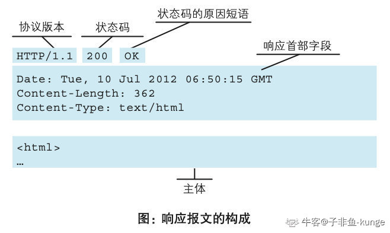

# HTTP
HTTP 全称 HyperText Transfer Proxy（超文本传输协议）。先看看几个与 HTTP 有关的概念。

## URI 与 URL
* URI（Uniform Resource Idendifier），统一资源标识符，用来定位互联网上的唯一资源。
* URL（Uniform Resource Location），统一资源定位符。URL 其实是 URI 的一个子集，不仅定义这个资源，而且定义了如何找到这个资源。

URL主要由四个部分组成：协议，主机，端口，路径，如下图所示。


## HTTP 报文格式
HTTP 报文格式如下图所示


请求和响应的报文格式都是基本相同的，只是起始行稍有不同。下面分别看一个请求和响应的例子

### 请求


请求方法通常有以下几类
* GET：请求 URL 指定的资源。GET 方法通常应该具有幂等性，即无论请求多少次，都只会返回资源，而不会额外创建或者改变资源。按照 HTTP 1.1 规范，GET请求只有头部，不应该有请求体。（即使有，服务器也应该忽略）
* HEAD：HEAD 请求应该与 GET 请求相同的资源，只不过 HEAD请求 只要求返回响应头部，不需要返回响应体。
* POST：POST 请求会提交一个请求体给服务器，一般用来创建、上传资源，不具有幂等性，一般将请求的资源附在请求体上传输。
* PUT：PUT 一般用来修改资源，与 POST 类似，将请求的资源附在请求体上传输。
* DELETE：DELETE 一般用来删除资源。
* OPTIONS：OPTIONS 请求 用来查询对资源可以实行的方法。这种请求在跨域中用的比较多（CORS）

### 响应


响应报文主要有5种类型的响应码：
* 1xx：提示信息，表示目前是协议处理的中间阶段，还需要后续的操作。例如 100 Continue
* 2xx：成功。报文已经收到并正确处理。
    * 200：OK。请求获取/创建资源 成功。
    * 201：Created。该请求已经成功，并因此创建了一个新的资源，通常使用在 POST 请求的响应中。
    * 206：Partial Content。服务器已成功处理了部分 GET 请求。
* 3xx：重定向。资源位置发生变化，需要客户端重新发送请求。
    * 301：Move Permanently。永久重定向，说明请求的资源已经永久被移动到了由 Location 指定的 URL 上，是固定的不会再变的。
    * 302：Found。临时重定向，表明请求的资源暂时移动到了由 Location 指定的 URL 上。
* 4xx：客户端错误。
    * 400：Bad Request。表明请求的语义有误或者参数有误。
    * 401：Unauthorized。当前请求用户需要验证。该响应必须包含一个适用于被请求资源的 WWW-Authenticate 信息头以询问用户信息。
    * 403：Forbidden。服务器已经理解请求但是拒绝执行，可以认为用户没有权限。
    * 404：Not Found。服务器未能发现所请求的资源。
    * 405：Method Not Allowed。该请求的资源不能执行指定的请求方法。该响应必须包含一个 Allow 头信息用以表示当前资源能够接受的请求方法列表。
* 5xx：服务器错误。
    * 500：Internal Server Error。服务器遇到意外情况并阻止请求执行。
    * 502：Bad Gateway。服务器作为网关需要得到一个处理这个请求的响应，但是得到了一个错误的响应。

### 常用头字段
请求和响应的 header 格式都是一样的，key-value 形式，用 `:` 分离。此外 HTTP 头部字段非常灵活，除了标准的 Host，Connection 等，也可以任意添加自定义头。

常用的头字段（待补充）

### 缓存管理
缓存管理是 HTTP 协议中非常重要的内容。对于资源来说，有些在很长一段时间内都不会更新，所以没必要每次都向 server 发送网络请求；如果第一次请求后能浏览器能保存在本地，下次请求直接在本地获取，那就会快得多，而且会减轻对服务器的压力。

涉及到缓存的 HTTP Header 是 Cache-Control。这个缓存指令是单向的，由服务器发送给客户端，告诉客户端可以缓存多久。例如：客户端发送请求后，服务器返回的响应中包含 `Cache-Control: max-age=30`，代表资源在客户端可以缓存30s。30s内客户端的请求可以直接从缓存获取，超过30s后则需要向服务器发送网络请求。

* `max-age`: 是 HTTP 缓存控制最常用的属性，表示资源存储的最长时间，需要注意的是，时间的计算起点是响应报文的创建时刻（即 Date 字段，也就是离开服务器的时刻），超过后客户端需要重新发起请求。:
* `no-cache`: 这个是很容易造成误解的字段，它的含义并不是不允许缓存，而是可以缓存，但在使用之前必须要去服务器验证是否过期，是否有最新的版本；
* `no-store`: 这才是真正的不允许缓存，比如秒杀页面这样变化非常频繁的页面就不适合缓存

### 连接管理
连接管理也是 HTTP 非常重要的功能，它是幕后英雄，对提升传输性能起到了很大的作用，也是促进 HTTP 不断改版演进的重要原因之一。

HTTP 使用 TCP 作为它的支撑传输协议。
我们可以从 HTTP 的各个版本看一看连接管理的功能改进。

在 HTTP 0.9，1.0 时期，每个 TCP 连接 只负责一次 HTTP 请求与响应，结束后该连接立马关闭，这种连接被称为短连接。
短连接下，用户请求一个 Web 页面时，如果页面上资源较多，用户需要建立很多个 TCP 连接，这是效率低下的，大量时间浪费在了三次握手和四次挥手中。

在 HTTP 1.1 中，连接管理得到了改进，每次报文发送后连接并不是立即关闭，可以复用，我们称这样的连接为长连接。对比如下图所示。


长短连接可以在 HTTP 请求的头部 `Connection` 字段中进行指定：`Connection: keep-alive` 表示使用长连接，`Connection: Close` 代表客户端希望使用短连接。在 HTTP 1.1 中，如果客户端没有指定该字段，默认使用长连接。

长连接让传输速率大大提升，但是由于 HTTP 报文规定必须一发一收，如果要在连接上发送多个 HTTP 报文，多个报文会累积在队列中依次处理（不能并行处理）。所以只要队首的请求被阻塞了，后续 HTTP 的发送都会被阻塞，这就是有名的 **队头阻塞**。


之所以会出现队头阻塞，是因为 HTTP 1.1中，报文规定，在同一个TCP连接中，HTTP请求和响应必须一发一收。之所以规定必须一发一收，是因为本质上，我们没法判断一个 TCP报文 是属于哪一个请求的。这也是实体首部字段 `Content-Length`存在的意义，接收方通过该字段判断几个请求报文组合后，大小是否达到了设定值：如果达到了，说明该报文接受完毕，可以对请求进行解析了；如果少于这个值，说明还需要继续接受请求包。 

#### 分块编码
注意，利用`Content-Length`判断报文是否结束有时候并不是一种好的方式。因为在实际应用中，有时候内容实体的长度不是那么容易获得，比如内容实体来自网络文件，或者是动态生成的。此时需要新的机制，分块机制，通过`Transfer-Encoding`这个头部字段进行设定。在 HTTP 1.1中，`Transfer-Encoding`只有一个值，那就是`chunked`，标志当前为分块编码传输。

分块编码的规则：
1. 每个分块包含一个 16 进制的数据长度值和真实数据。
2. 数据长度值独占一行，和真实数据通过 CRLF(\r\n) 分割。
3. 数据长度值，不计算真实数据末尾的 CRLF，只计算当前传输块的数据长度。
4. 最后通过一个数据长度值为 0 的分块，来标记当前内容实体传输结束。

在这种机制下，可以在一个TCP连接中，灵活地传输一开始长度不那么好确定的数据。一个例子如下：
```
HTTP/1.1 200 OK
Content-Type: text/plain
Transfer-Encoding: chunked

7\r\n
Mozilla\r\n
9\r\n
Developer\r\n
7\r\n
Network\r\n
0\r\n
\r\n
```

HTTP 2.0 待补充。
