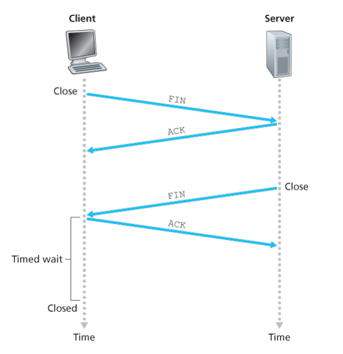

# 传输层（TCP，UDP）
传输层位于应用层和网络层中间，是分层网络体系结构中的重要部分。

传输层协议为运行在不同主机上的应用进程之间提供了**逻辑通信**。从应用程序的角度来看，通过逻辑通信，运行不同进程的主机好像之间相连一样。应用进程使用传输层提供的逻辑通信功能彼此发送报文，而无需考虑这些报文的物理基础设施的细节。

因特网中的传输层协议主要有两种，TCP 和 UDP。其中：
* UDP 是不可靠，无连接的服务
* TCP 是可靠，面向连接的服务。

###  多路复用与多路分解
一个主机里可以有很多个套接字（socket）。当主机接受到达的传输层报文段时，它需要将报文段定向到适当的套接字。为此目的，每个传输层报文段上具有几个字段。

在接收端，传输层检查这些字段，标志出接受套接字，进而将报文段定向到该套接字。将运输层报文段中的数据交付到正确的套接字的工作称为**多路分解**（multiplexing）。

另一方面，源主机从不同套接字中收集数据块，并为每个数据块封装上首部信息（这将在以后用于分解）从而生成报文段，然后将报文段传递到网络层，这些工作被称为**多路复用**（multiplexing）。

一个UDP套接字是由一个二元组进行标识的，该二元组包含一个**目的IP地址**和一个**目的端口号**。因此，如果两个UDP报文段有不同的源IP地址和/或端口号，但具有相同的目的IP地址和目的端口号，那么这两个报文段将通过相同的目的套接字被定向到相同的目的进程。

## TCP 报文段结构
TCP报文段的头部结构如下图所示

其中各字段含义如下

**Source Port (16 bit)**：发送方的端口

**Destination Port (16 bit)**：接收方的端口

**Sequence Number (32 bit)**

当 SYN 设为1时，此报文段是初始报文段（三次握手中的前两次），此时 Sequence Number 表示的是初始序列号(此时该报文段内没有实际内容，回复方需要将`Acknowledge Number`设为`sequence number + 1`）。

当 SYN 设为0时，此报文段是数据报文段，此时 Sequence Number 表示的是该报文段数据中**第一个字节**的序列号。

**Acknowledge Number (32 bit)**

当 ACK 设为1时，表示 Acknowledge Number 字段是有意义的。此时该字段表示的是发送者已经收到了 `acknowledge number - 1`的所有数据，期待的下一个序列号就是 `akknowledge number`。

**Data Offset (4 bit)**

表示TCP头部的大小（用 32-bit word 单位表示）。TCP头部的最小大小是5个word（20字节），最大是15个word（60字节），因此下面的 Options 最大是40字节。

**Reserved (3 bit)**：保留字段，应置0

**Flags (9 bit)**

此字段包含9个flag，分别如下：
* NS: ECN-nonce，隐藏保护。
* CWR: Congestion Window Reduced（CWR）置为1时，表示发送方已经收到过一个带有 ECE 位的 TCP报文段，并且已经回应了拥塞控制机制。
* ECE：ECN-Echo 有两层含义：当 SYN 置为1时，将ECE置为1表示发送方支持ECN机制；当 SYN 不是1时，此字段表示网络拥塞的指示。
* URG：置为1时，表示 Urgent pointer field 是有意义的。
* ACK：表示 Acknowledge Number 是有意义的。除了三次握手中的第一次（也就是客户端发送的第一个请求）以外，其余所有TCP报文段应该将此位置为1.
* PSH：置为1时，表示接收方应该立即将数据交给上层应用。
* RST：置为1时，表示需要重置连接。
* SYN：Synchronize sequence numbers。用于建立TCP连接，只有终端发送的第一个TCP数据包（也就是三次握手中的前两次）需要将此位置为1.
* FIN：用于结束TCP连接。某一端发送带有FIN位的报文段时，表明该端已经发送了所有的数据包，没有需要再发的报文段了。

**Window Size (16 bit)**

用来表示接收窗口的大小，表示发送方期望收到的数据大小（用于流量控制和窗口缩放）

**Checksum (16bit)**: 用来校验数据段有没有出错。

**Urgent Pointer (16 bit)**

当 URG 置为1时，表示紧急数据存在，此指针表示紧急数据的最后一个字节。当紧急数据存在并且给出指向紧急数据尾的指针时，TCP 必须通知接收端的上层应用。

**Options**：暂略，详情见[维基百科](https://en.wikipedia.org/wiki/Transmission_Control_Protocol)

## TCP 连接管理
TCP 建立连接：三次握手。如下图所示

* 第一步：客户端首先像服务器端发送一个特殊的 TCP 报文段，该报文段不包含应用层数据，首部的标志位SYN 置为1，因此这个特殊报文段被称为 SYN 报文段。客户端会在该报文段中随机加入一个初始序号（client_isn），并将其放在 Sequence Number 字段中。
* 第二步：当服务器收到客户端发送的第一条 SYN 报文段后，会向客户端发送允许连接的报文段。该报文段中也不包含应用层数据，其首部包含三个重要信息。首先，SYN比特被置为1.其次，该TCP报文段中首部的Acknowledge Number 被置为 `client_isn + 1`。最后，服务器选择子集的初始序列号 server_isn，并将其置于 Sequence Number 字段中。该报文段的含义可以理解为：我收到了你发起建立连接的 SYN 分组，该分组带有初始序号 client_isn。我同意建立该连接，我自己的初始序号是 server_isn。该允许连接的报文段有时被称为 SYNACK 报文段。
* 第三步：客户端在收到 SYNACK 报文段后，再次向主机发送报文段，这最后一个报文段对服务器允许连接的报文段进行了确认，将首部中的 Acknowledge Number 置为 `server_isn + 1`。此时因为连接已经建立了，所以该报文段中的 SYN 比特被置为0。这个报文段中是可以携带数据的。

TCP 终止连接：四次挥手。如下图所示

参与一条TCP的两个进程中的任何一个都能终止 TCP 连接。当连接结束后，主机中的“资源”（即缓存和变量）将被释放。例如，客户打算关闭连接：
* 客户TCP向服务器进程发送一个特殊的 TCP 报文段。该报文段的标志位 FIN 被设为1（表示客户端该发的数据都发完了）.
* 服务器收到该报文段后，会像客户端发送一个确认报文段，表示已经接收到所有数据。
* 然后，服务器发送它自己的终止报文段，其FIN比特被置为1（表示服务器该发的数据都发送完了）
* 最后，客户对服务器的终止报文段进行确认。
此时客户端会进入 TIME_WAIT 阶段。假定确认报文段丢失，TIME_WAIT状态使 TCP 客户重传最后的确认报文（TIME_WAIT 状态典型时间是 30s，1min 或者 2min）。经过等待后，连接正式关闭，客户端所有资源将被释放。

## TCP的流量控制
一条TCP连接的每一侧主机都为该连接设置了接收缓存。当该TCP连接收到正确、按序的字节后，它就将数据放入接收缓存。相关联的应用程序会从该缓存中读取数据，但不一定是数据刚一到达就立即读取。所以如果某一应用程序读取数据相对较慢，而发送方发送得太多太快，发送的数据就很容易使该连接的接收缓存溢出。

为了消除发送方使接收方缓存溢出的可能性，TCP 为它的应用程序提供了流量控制服务（flow-control service）。

> 注意，这里需要与下面的拥塞控制区分开来，拥塞控制指的是TCP发送方因为IP网络的拥塞而被遏制。

TCP 通过让发送方维护一个称为接收窗口（receive window）的变量来提供流量控制。接收窗口用于给发送方一个指示——该接收方还有多少可用的缓存空间。因为 TCP 是全双工通信，再连接两端的发送方都各自维护一个接受窗口。（也就是前面提到的 TCP头部字段中的 Window Size 字段）。

## TCP的拥塞控制
上面也提到过，拥塞控制指的是TCP发送方因为IP网络的拥塞而被遏制发送速率。TCP 使用如下指导性原则来进行拥塞控制：
1. 一个丢失的报文段意味着拥塞，因此当丢失报文段时应该降低发送方的速率。
2. 一个确认报文段指示该网络正在向接收方交付发送方的报文段，因此，当对先前未确认报文段的确认到达时，能够增加发送方的速率。
3. 带宽探测。TCP发送方的行为类似于要求越来越多糖果的孩子，直到最后告诉它“不行”，孩子就会后退一点，然后过一会儿再次提出请求。注意在网络中没有明显的拥塞状态信息，因此确认报文和丢包事件充当了隐式信号。

TCP的拥塞控制算法主要包括三个部分：慢启动、拥塞避免、快速恢复。