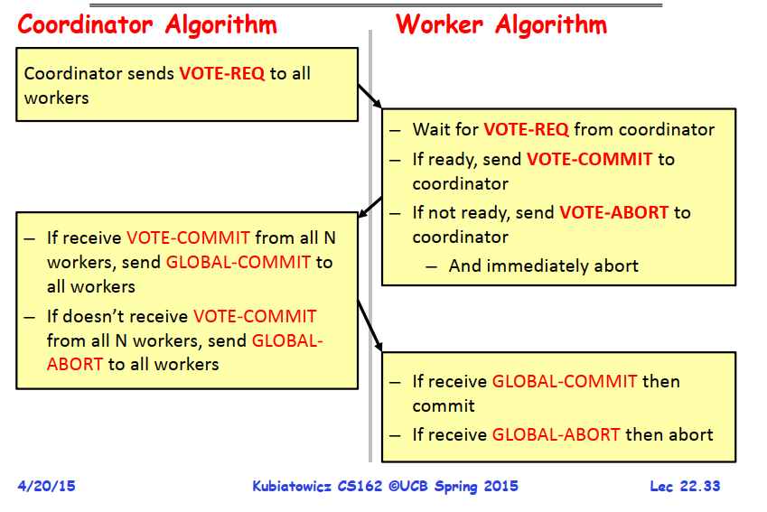

# 分布式事务
国际开放标准组织 Open Group 定义了 DTP（Distributed Transaction Processing）规范，在规范中描述了全局的事务管理器和局部的资源管理器之间的接口。该规范的目的是允许多个资源（如数据库，应用服务器，消息队列等）在同一事务中进行访问，这样可以使事务的 ACID 属性跨越应用程序而有效。该规范使用两阶段提交（Two-Phase Commit）来保证所有资源同时提交或者回滚。

## 两阶段提交（Two-phase commit）
> 两阶段提交协议是由图灵奖得主 Jim Gray 提出的 

两阶段提交协议把分布式事务分为两个阶段，一个是准备阶段，一个是提交阶段。流程如下：
* 准备阶段：协调者向所有参与者发起指令，询问参与者是否准备好进行commmit。
    * 如果参与者评估指令能够完成，就锁定资源，写好操作日志，然后返回 VOTE-COMMIT 信息给协调者。
    * 如果参与者评估指令不能完成，就向协调者发送 VOTE-ABORT 指令，然后自己直接中止事务。
* 提交阶段：如果每个参与者都返回了 VOTE-COMMIT 指令，则协调者向所有参与者发起 GLOBAL-COMMIT指令；如果有任何一个参与者返回了 VOTE-ABORT 指令或者超时未发送，则协调者向所有参与者发送 GLOBAL-COMMIT 指令。
    * 参与者收到 GLOBAL-COMMIT 指令后，会提交本地事务，释放资源。
    * 参与者收到 GLOBAL-ABORT 指令后，会在本地回滚事务。

该协议具体如下图所示

两阶段提交协议在准备阶段时，参与者会锁定资源，一直等待直到协调者发来 GLOBAL-SUBMIT 或 GLOBAL-ABORT 命令。这是一个重量级的操作，能保证强一致性，但是实现起来比较复杂，成本较高，有个很大的问题是会引起阻塞（blocking）。尤其是当参与者在等待协调者的 COMMIT 或 ABORT 指令时，如果协调者挂掉，那么参与者会一直阻塞，直到协调者恢复。

为了解决阻塞问题，有一些其他的分布式事务算法被提出，例如 三阶段提交协议，PAXOS，TCC 等。