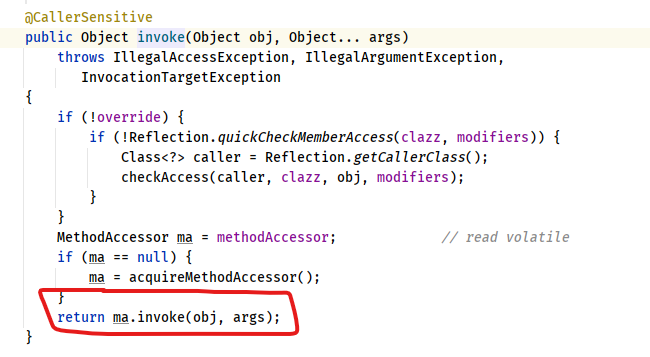

# Java 反射
在运行时识别一个对象的类型和类的信息有两种方法：
1. 传统的 RTTI（Run-Time Type Identification）。它假定我们在编译器已经知道了所有类型信息。
2. 反射机制，它允许我们在运行时发现和使用类的信息。

关于反射，与其有关的类有四个：Class，Field，Constructor, Method:
* Class: 用来表示运行时类型信息，每个 Class 类对象内部包含了这个类的所有信息。
* Field：描述一个类的”属性“，内部包含了该属性的所有信息，例如数据类型，属性名，访问修饰符。
* Constructor：描述一个类的构造方法，内部包含了构造方法的所有信息，例如 参数类型，参数名字，访问修饰符。
* Method：描述一个类的所有方法（包括抽象方法），内部包含了该方法的所有信息，与 Constructor 类似，不同之处是 Method 拥有返回值类型，因为构造方法是没有返回值的。


## Class
在 Java 中用来表示运行时类型信息的类就是 Class 类（java.lang.Class）。

在 Java 中每个类都有且只有一个 Class 对象。 每当我们编写并且编译一个新创建的类，都会产生一个 Class 对象（更确切的说，是保存在了一个同名的 .class 文件中）。为了生成这个类的对象，JVM 使用类加载器（ClassLoader）的子系统。

所有的类都是在第一次对其进行使用时，动态加载到 JVM 中来的。当程序创建第一个对类的静态成员的引用时，就会加载这个类。（这证明构造器也是类的静态方法，因为即使在构造器之前并没有使用 static 关键字，使用 new 创建类的新对象时也会被当作对类的静态引用，从而加载这个类）。

获取 Class 对象的方法有三种：
* `Class.forname(String className)`: 通过类的**全限定名**获取该类的 Class 对象

```java
//1、通过Class.forName获取Employee类的Class对象
String classPath = "reflect.Employee";
try {
    Class<?> employeeClass1 = Class.forName(classPath);
} catch (ClassNotFoundException e) {
    e.printStackTrace();
}
```
> 注意：调用forName方法时，需要捕获一个名称为ClassNotFoundException的异常，因为编译器是无法检测到其传递的字符串对应的类是否存在的，只能在程序运行时进行检查，如果不存在就会抛出ClassNotFoundException异常。

* 实例.getClass(): 通过实例化对象获取该对象的 Class 对象
```java
Employee employee = new Employee();
Class<?> employeeClass2 = employee.getClass();
```
> getClass() 是从顶级类 Object 中继承而来的。

* 类名.Class（Class 字面常量）：这种获取方式只有在编译前已经声明了该类的类型才能获取到 Class 对象
```java
Class<Employee> employeeClass3 = Employee.class;
```
> 这种方式更简单，更安全。因为它在编译期，就会受到编译器的检查，同时因为这种方式不会自动初始化该类，效率也会更高。
更加有趣的是，这种引用方式不仅可以应用于普通的类，也可以应用于接口，数组以及基本数据类型，这点在反射技术应用传递参数时很有帮助。基本数据类型还有对应的包装类型，其包装类型有一个标准字段TYPE，而这个TYPE就是一个引用，指向基本数据类型的Class对象，其等价转换如下，一般情况下更倾向使用.class的形式，这样可以保持与普通类的形式统一。

其他几个类 （Field，Method，Constructor）有空再详细看。

## 反射
反射机制是 Java 语言所提供的一种基础功能，赋予程序在运行时自省（introspect）的能力。通过反射我们可以直接操作类或者对象，比如获取某个对象的类定义，获取类声明的属性和方法，调用方法或构造对象，甚至可以运行时修改类定义。

Class 类和 `java.lang.reflect` 类库一起对反射的概念进行了支持，该类库包含了 `Field, Method, Constructor` 类（每个类都实现了 Member 接口）。这些类型的对象是由 JVM 在运行时创建的，用以表示未知类里对应的成员。这样你就可以使用 Constructor 创造新的对象，用 get() 和 set() 方法读取和修改与 Field 对象关联的字段，用 invoke() 方法调用与 Method 对象关联的方法。另外，还可以调用 getFields(), getMethods, getConstructors() 等很便利的方法，以返回表示字段、方法以及构造器的对象的数组（可以在 JDK 文档中查找 Class 类了解更多相关资料）。这样，匿名类的类信息就能在运行时被完全确定下来，而在编译时不需要知道任何事情。

这里举个简单的例子
```java
package reflection;

public class ClassTest {
    private int price;

    public int getPrice() {
        return price;
    }

    public void setPrice(int price) {
        this.price = price;
    }
    public static void main(String[] args) throws ClassNotFoundException, NoSuchMethodException, InvocationTargetException, InstantiationException, IllegalAccessException {
        // 正常调用
        ClassTest classTest = new ClassTest();
        classTest.setPrice(5);
        System.out.println("Price: " + classTest.getPrice());
        // 使用反射调用
        Class clz = Class.forName("reflection.ClassTest");
        Method setPriceMethod = clz.getMethod("setPrice", int.class);
        Constructor constructor = clz.getConstructor();
        Object obj = constructor.newInstance();
        setPriceMethod.invoke(obj, 14);
        Method getPriceMethod = clz.getMethod("getPrice");
        System.out.println("Price: " + getPriceMethod.invoke(obj));
    }
}

```

重要的是，要认识到反射机制并没有什么神奇之处。当通过反射与一个未知类型的对象打交道时，JVM 只是简单的检查这个对象，看它属于哪个特定的类（就像 RTTI 那样）。在用它做其他事情之前，必须先加载那个对象的 Class 对象。因此，那个类的 .class 文件对于 JVM 来说必须是可以获取到的：要么在本地机器上，要么可以通过网络获得。所以 RTTI 与反射之间真正的区别只在于，对 RTTI 来说，编译器在编译时就打开和检查 .class 文件（换句话说，我们可以通过普通的方式调用对象的所有方法）。而对于反射机制来说，.class 文件在编译时是不可获取的，所以是在运行时打开和检查 .class 文件。

## 反射源码解析
知道了如何使用反射后，我们来看看反射背后的源码吧。

在开发 Web 应用时，可能会遇到过下面的异常：
```
java.lang.NullPointerException 
...
sun.reflect.DelegatingMethodAccessorImpl.invoke(DelegatingMethodAccessorImpl.java:43)
  at java.lang.reflect.Method.invoke(Method.java:497)
```
可以看到异常堆栈指出了异常在 Method 的第 497 行的 invoke 方法中出现了异常。

例如我们经常使用的 Spring 配置中，经常会出现相关 Bean 的配置
```
<bean class="com.chenshuyi.Apple">
</bean>
```
当我们在 XML 中配置了上面这个 bean 后，Spring 便会在启动的时候通过反射去加载对应的 Apple 类。而当 Apple 类不存在或者启动异常时，异常堆栈就会指向调用的 invoke 方法。

从这里可以看出，要向弄清楚反射的原理，就可以进 Method 类的 invoke 方法看看了。

进入 Method 的 invoke 方法后，可以看到，一开始是执行了一些权限检查，然后调用了 MethodAccessor 类的 invoke 方法进一步处理，如下图所示：


那么 MethodAccessor 是什么呢？其实它是一个接口，定义了方法调用的具体操作，而它由三个具体实现的类：
* `sun.reflect.DelegatingMethodAccessorImpl`
* `sun.reflect.MethodAccessorImpl`
* `sun.reflect.NativeMethodAccessorImpl`

而要看 ma.invoke() 到底调用的是哪个类的 invoke 方法，则需要看看 MethodAccessor 对象返回的到底是哪个类对象，所以我们需要进入 `Method.acquireMethodAccessor()` 方法中看看。

经过一系列源码追踪，再加上阅读 `MethodAccessor` 的注释，我们可以知道：

> "Inflation" mechanism. Loading bytecodes to implement Method.invoke() and Constructor.newInstance() currently costs 3-4x more than an invocation via native code for the first invocation (though subsequent invocations have been benchmarked to be over 20x faster).Unfortunately this cost increases startup time for certain applications that use reflection intensively (but only once per class) to bootstrap themselves.Inflation 机制。初次加载字节码实现反射，使用 Method.invoke() 和 Constructor.newInstance() 加载花费的时间是使用原生代码加载花费时间的 3 - 4 倍。这使得那些频繁使用反射的应用需要花费更长的启动时间。To avoid this penalty we reuse the existing JVM entry points for the first few invocations of Methods and Constructors and then switch to the bytecode-based implementations. Package-private to be accessible to NativeMethodAccessorImpl and NativeConstructorAccessorImpl.为了避免这种痛苦的加载时间，我们在第一次加载的时候重用了 JVM 的入口，之后切换到字节码实现的实现。

就像注释里说的，实际的 MethodAccessor 实现有两个版本，一个是 Native 版本，一个是 Java 版本。Native 版本一开始启动快，但是随着运行时间边长，速度变慢。Java 版本一开始加载慢，但是随着运行时间边长，速度变快。正是因为两种存在这些问题，所以第一次加载的时候我们会发现使用的是 NativeMethodAccessorImpl 的实现，而当反射调用次数超过 15 次之后，则使用 MethodAccessorGenerator 生成的 MethodAccessorImpl 对象去实现反射。

## 关于 setAccessible(boolean flag)
关于反射，还有一点要提一下，就是反射提供的 `AccessibleObject.setAccessible​(boolean flag)`。它的子类也大都重写了这个方法，这里的所谓 `accessible` 可以理解成修饰成员的 public、protected、private，这意味着我们可以在运行时修改成员访问限制！

`setAccessible` 的应用场景非常普遍，遍布我们的日常开发、测试、依赖注入等各种框架中。比如，在 O/R Mapping 框架中，我们为一个 Java 实体对象，运行时自动生成 setter、getter 的逻辑，这是加载或者持久化数据非常必要的，框架通常可以利用反射做这个事情，而不需要开发者手动写类似的重复代码。

另一个典型场景就是绕过 API 访问控制。我们日常开发时可能被迫要调用内部 API 去做些事情，比如，自定义的高性能 NIO 框架需要显式地释放 DirectBuffer，使用反射绕开限制是一种常见办法。

## 动态代理
提到了反射，就不得不提一下动态代理了。动态代理是一种方便运行时动态构建代理，动态处理代理方法调用的机制，很多场景都是利用类似机制做到的，比如用来包装 RPC 调用，面向切面的编程（AOP）。

实现动态代理的方法有很多，比如 JDK 自身提供的动态代理，就是主要利用了上面提到的反射机制。还有其它的实现方式，比如利用传说中更高效的字节码操作机制，类似 ASM，cglib（基于ASM），Javassist 等。

下面看一个 JDK 动态代理的简单例子。下面只是加了一句 print，在生产系统中，可以轻松扩展类似逻辑进行诊断，限流等。
```java
public class MyDynamicProxy {
    public static void main(String[] args) {
        HelloImpl hello = new HelloImpl();
        MyInvocationHandler handler = new MyInvocationHandler(hello);
        // 构造代码实例
        Hello proxyHello = (Hello) Proxy.newProxyInstance(HelloImpl.class.getClassLoader(), HelloImpl.class.getInterfaces(), handler);
        // 调用代理方法
        proxyHello.sayHello();
    }

}

interface Hello {
    void sayHello();
}

class HelloImpl implements Hello {
    @Override
    public void sayHello() {
        System.out.println("Hello World");
    }
}

class MyInvocationHandler implements InvocationHandler {
    private Object target;

    public MyInvocationHandler(Object object) {
        this.target = object;
    }

    @Override
    public Object invoke(Object proxy, Method method, Object[] args) throws Throwable {
        System.out.println("Invoking sayHello");
        Object result = method.invoke(target, args);
        return result;
    }
}
```
上面的例子，非常简单的实现了动态代理的构建和代理操作。首先，实现对应的 InvocationHandler；然后，以接口 Hello 为纽带，为被调用目标构建代理对象，进而应用程序就可以使用代理对象间接运行调用目标的逻辑，代理为应用插入额外逻辑（这里是 println）提供了便利的入口。

从 API 设计和实现的角度，这种实现仍然有局限性，因为它是以接口为中心的，相当于添加了一种对于被调用者没有太大意义的限制。我们实例化的是 Proxy 对象，而不是真正的被调用类型，这在实践中还是可能带来各种不便和能力退化。

如果被调用者没有实现接口，而我们还是需要实现动态代理，那么可以考虑其他方式。我们知道 Spring AOP 支持两种模式的动态代理，JDK Proxy 或者 cglib，如果我们选择 cglib 方式，就会发现对接口的依赖被克服了。

cglib动态代理采用的是创建目标类的子类的方式，因为是子类化，我们可以达到近似使用被调用者本身的效果。在 Spring 编程中，框架通常会处理这种情况，当然我们也可以显式指定。关于类似方案的实现细节，我就不再详细讨论了。

动态代理应用非常广泛，虽然最初多是因为 RPC 等使用进入我们视线，但是动态代理的使用场景远远不仅如此，它完美符合 Spring AOP 等切面编程。我在后面的专栏还会进一步详细分析 AOP 的目的和能力。简单来说它可以看作是对 OOP 的一个补充，因为 OOP 对于跨越不同对象或类的分散、纠缠逻辑表现力不够，比如在不同模块的特定阶段做一些事情，类似日志、用户鉴权、全局性异常处理、性能监控，甚至事务处理等，你可以参考下面这张图。


AOP 通过（动态）代理机制可以让开发者从这些繁琐事项中抽身出来，大幅度提高了代码的抽象程度和复用度。从逻辑上来说，我们在软件设计和实现中的类似代理，如 Facade、Observer 等很多设计目的，都可以通过动态代理优雅地实现。