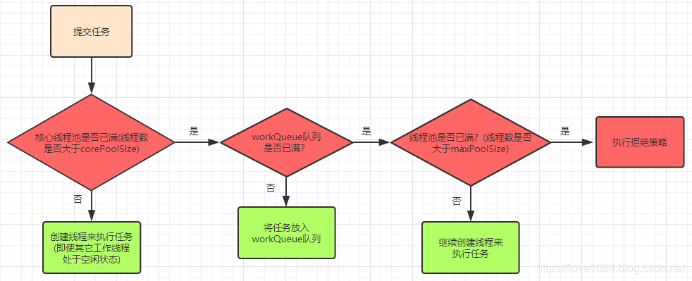

# Java 线程池
线程是不能够重复启动的，创建或者销毁线程存在一定的开销，所以利用线程池技术来**提高系统资源利用效率，并简化线程管理**，已经是非常成熟的选择。

首先我们来看看 Java 并发类库提供的线程池有哪几种？分别有什么特点？

通常开发者都是利用 Executors 提供的通用线程池创建方法（静态方法），去创建不同配置的线程池，主要区别在于不同的 ExecutorService 类型或者不同的初始参数。
> 例如 `Executors.newCachedThreadPool()` 可用创建一个缓存线程池。

Executors 目前提供了 5 种不同的线程池创建配置：
* `newCachedThreadPool()`，它是一种用于处理大量短时间工作任务的线程池，具有几个鲜明特点：它会试图缓存线程并重用，当无缓存线程可用时，就会创建新的工作线程；如果线程的闲置时间超过 60 s，则被终止并移除缓存；长时间闲置时，这种线程池，不会消耗什么资源。其内部使用 SynchronousQueue 作为工作队列（因为来一个任务就创建一个线程来执行任务，用不到队列来存储任务）
* `newFixedThreadPool(int nThread)`，重用指定数目的线程，背后使用的是无界的工作队列（LinkedBlockingQueue），任何时候最多有 nThread 个工作线程是活动的。这意味着，如果任务数量超过了活动队列数目，将在工作队列中等待空闲线程出现；如果有工作线程退出，将会有新的工作线程被创建，以补足指定的数目 nThread。
* `newSingleThreadExecutor()`，它的特点在于工作线程数目被限制为 1，操作一个无界的工作队列，所以它保证了所有任务的都是被顺序执行，最多会有一个任务处于活动状态，并且不允许使用者改动线程池实例，因此可以避免其改变线程数目。
* `newSingleThreadScheduledExecutor() 和 newScheduledThreadPool(int corePoolSize)`，创建的是个 ScheduledExecutorService，可以进行定时或周期性的工作调度，区别在于单一工作线程还是多个工作线程。
* `newWorkStealingPool(int parallelism)`，这是一个经常被人忽略的线程池，Java 8 才加入这个创建方法，其内部会构建ForkJoinPool，利用Work-Stealing算法，并行地处理任务，不保证处理顺序。

## 线程池的设计和结构
在大多数情况下，使用 Executors 提供的 5 个静态方法就足够了，但是仍可能需要直接利用 ThreadPoolExecutor 等构造函数创建，这就要求我们对线程构造方式有进一步的了解，我们需要明白线程池的设计和结构。

首先我们来看看 Executor 框架的基本组成，参考下面的类图。


首先从整体上把握一下各个类型的主要设计目的：
* Executor 是一个基础的接口，其初衷是将任务提交和任务执行细节解耦，这一点可以体会其定义的唯一方法。
```java
void execute(Runnable commmand);
```
Executor 的设计是源于 Java 早期线程 API 使用的教训，开发者在实现应用逻辑时，被太多线程创建、调度等不相关细节所打扰。就像我们进行 HTTP 通信，如果还需要自己操作 TCP 握手，开发效率低下，质量也难以保证。
* ExecutorService 则更加完善，不仅提供 service 的管理功能，比如 shutdown 方法，也提供了更为全面的提交任务机制，如返回 Future 而不是 void 的 submit 方法。
```java
<T> Future<T> submit(Callable<T> task);
```
> 注意，这个例子输入的是 Callable，它解决了 Runnable 无法返回结果的困扰。
* Java 标准类库提供了几种基础实现，比如 ThreadPoolExecutor、ScheduledThreadPoolExecutor、ForkJoinPool。这些线程池的设计特点在于其高度的可调节性和灵活性，以尽量满足复杂多变的实际应用场景，我会进一步分析其构建部分的源码，剖析这种灵活性的源头。
* Executors 则从简化使用的角度，为我们提供了各种方便的静态工厂方法。

下面从源码的角度，分析线程池的设计和实现，这里主要围绕最基础的 ThreadPoolExecutor 源码。
> ThreadPoolExecutor 源码。ScheduledThreadPoolExecutor 是 ThreadPoolExecutor 的扩展，主要是增加了调度逻辑，如想深入了解，你可以参考相关教程。而 ForkJoinPool 则是为 ForkJoinTask 定制的线程池，与通常意义的线程池有所不同。

这部分内容很晦涩，罗列概念也不利于理解，所以配合一些示意图来说明。在现实应用中，理解应用与线程池的交互和线程池的内部工作原理，可以参考下图


* 工作队列负责存储用户提交的各个任务。这个工作队列，可以是容量为 0 的 SynchronousQueue(在 newCachedThreadPool 中使用)，也可以是像固定大小线程池（newFixedThreadPool）中一样使用 LinkedBlockingQueue。
```java
private final BlockingQueue<Runnable> workQueue;
```
* 内部的线程池，这是指保持工作线程的集合，线程池需要在运行过程中管理线程创建、销毁。例如，对于带缓存的线程，当任务压力过大时，线程池会创建新的工作线程；当业务压力褪去时，线程池会闲置一段时间（默认 60s）后结束线程。
```java
private final HashSet<Worker> workers = new HashSet<>();
```

线程池的工作线程被抽象为静态内部类 `Worker`，基于 `AbstractQueuedSynchronizer` (AQS) 实现。
* `ThreadFactory` 提供上面所需要的创建线程逻辑
* 如果任务提交时被拒绝，比如线程池已经处于 SHUTDOWN 状态，需要为其提供处理逻辑，Java 标准库提供了类似 `ThreadPoolExecutor.AbortPolicy` 等默认实现，也可以按照实际需求自定义。

从上面的分析，就可以看出线程池的几个基本组成部分，一起都体现在线程池的构造函数中。
线程池的构造函数为：
```java
public ThreadPoolExecutor(int corePoolSize,
                              int maximumPoolSize,
                              long keepAliveTime,
                              TimeUnit unit,
                              BlockingQueue<Runnable> workQueue) {

} 
```
从字面我们就可以大概猜测到其用意：
* corePoolSize，所谓的核心线程数，可以大致理解为长期驻留的线程数目（除非设置了 allowCoreThreadTimeOut）。对于不同的线程池，这个值可能会有很大区别，比如 newFixedThreadPool 会将其设置为 nThreads，而对于 newCachedThreadPool 则是为 0。需要注意的是，线程池初始化时，默认是没有线程的，只有当任务来临时，才会创建线程去执行任务。
* maximumPoolSize，顾名思义，就是线程不够时能够创建的最大线程数。同样进行对比，对于 newFixedThreadPool，当然就是 nThreads，因为其要求是固定大小，而 newCachedThreadPool 则是 Integer.MAX_VALUE。需要注意的是，只有当 workQueue 队列填满时，才会创建多余 corePoolSize 的线程。
* keepAliveTime 和 TimeUnit，这两个参数指定了额外的线程能够闲置多久，显然有些线程池不需要它。非核心线程的空闲时间超过keepAliveTime 就会被自动终止回收掉。注意当 corePoolSize=maxPoolSize 时，keepAliveTime 参数也就不起作用了(因为不存在非核心线程)；
* workQueue，工作队列，必须是 BlockingQueue。可以为无界、有界、同步移交三种队列类型之一，当池子里的工作线程数大于corePoolSize 时，新进来的任务会被放到队列中。

线程池中的线程创建流程图：


举个例子：现有一个线程池，corePoolSize=10，maxPoolSize=20，队列长度为 100，那么当任务过来会先创建 10 个核心线程数，接下来进来的任务会进入到队列中直到队列满了，会创建额外的线程来执行任务(最多 20 个线程)，这个时候如果再来任务就会执行拒绝策略

## AQS
AbstractQueuedSynchronizer (AQS, 抽象队列同步器) 位于 `java.util.concurrent.locks` 包下面。AQS 是一个用来构建锁和同步器的框架，使用 AQS 能够简单且高效的构建出广泛大量的同步器，比如我们提到的 ReentrantLock，Semephore 等。其他的诸如 `ReentrantReadWriteLock, SynchronousQueue, FutureTask` 都是基于 AQS 的。当然，我们也可以利用 AQS 实现符合自己需求的同步器。

AQS 的核心思想是，如果被请求的共享资源空闲，则将当前请求资源的线程设置为有效的工作线程，并且将共享资源设置为锁定状态。如果被请求的共享资源被占用，那么就需要一套线程阻塞等待以及被唤醒时分配锁的机制，这个机制 AQS 是用 CLH 队列锁实现的，即将暂时获取不到锁的线程加入到队列中。

> CLH(Craig, Landin, and Hagersten)队列是一个虚拟的双向队列（虚拟的双向队列即不存在队列实例，仅存在结点之间的关联关系）。AQS 是将每条请求共享资源的线程封装成一个 CLH 锁队列的一个结点（Node）来实现锁的分配。

AQS 的原理图如下：


AQS 使用一个 int 成员变量来表示同步状态，通过内置的 FIFO 队列来完成获取资源线程的排队工作。AQS 使用 CAS 对该同步状态进行原子操作实现对其值的修改。

```java
private volatile int state;//共享变量，使用volatile修饰保证线程可见性
```

状态信息通过 protected 类型的 getState，setState，compareAndSetState 进行操作：

```java
//返回同步状态的当前值
protected final int getState() {
        return state;
}
 // 设置同步状态的值
protected final void setState(int newState) {
        state = newState;
}
//原子地（CAS操作）将同步状态值设置为给定值update如果当前同步状态的值等于expect（期望值）
protected final boolean compareAndSetState(int expect, int update) {
        return unsafe.compareAndSwapInt(this, stateOffset, expect, update);
}
```

AQS 定义了两种资源共享方式：独占式（Exclusive）和共享式（Share）。其中 ReentrantLock 就是经典的独占式，而 Semaphore，CountDownLatch，CyclicBarrier，ReadWriteLock 则是经典的共享式。

### AQS 底层使用了模板方式模式
同步器的设计是基于模板方法模式的，如果需要自定义同步器一般的方式是这样（模板方法模式很经典的一个应用）：
1. 使用者继承 AbstractQueuedSynchronizer 并重写指定的方法。（这些重写方法很简单，无非是对于共享资源 state 的获取和释放）
2. 将 AQS 组合在自定义同步组件的实现中，并调用其模板方法，而这些模板方法会调用使用者重写的方法。

这和我们以往通过实现接口的方式有很大区别，这是模板方法模式很经典的一个运用，下面简单的给大家介绍一下模板方法模式，模板方法模式是一个很容易理解的设计模式：
> 模板方法模式是基于”继承“的，主要是为了在不改变模板结构的前提下在子类中重新定义模板中的内容以实现复用代码。举个很简单的例子假如我们要去一个地方的步骤是：购票buyTicket()->安检securityCheck()->乘坐某某工具回家ride()->到达目的地arrive()。我们可能乘坐不同的交通工具回家比如飞机或者火车，所以除了ride()方法，其他方法的实现几乎相同。我们可以定义一个包含了这些方法的抽象类，然后用户根据自己的需要继承该抽象类然后修改 ride()方法。

AQS 使用了模板方法模式，自定义同步器时需要重写下面几个 AQS 提供的模板方法：
```java
isHeldExclusively()//该线程是否正在独占资源。只有用到condition才需要去实现它。
tryAcquire(int)//独占方式。尝试获取资源，成功则返回true，失败则返回false。
tryRelease(int)//独占方式。尝试释放资源，成功则返回true，失败则返回false。
tryAcquireShared(int)//共享方式。尝试获取资源。负数表示失败；0表示成功，但没有剩余可用资源；正数表示成功，且有剩余资源。
tryReleaseShared(int)//共享方式。尝试释放资源，成功则返回true，失败则返回false。
```

默认情况下，每个方法都抛出 UnsupportedOperationException。 这些方法的实现必须是内部线程安全的，并且通常应该简短而不是阻塞。AQS 类中的其他方法都是 final ，所以无法被其他类使用，只有这几个方法可以被其他类使用。

以 `ReentrantLock` 为例，`state` 初始化为 0，表示未锁定状态。A 线程 `lock()` 时，会调用 `tryAcquire()` 独占该锁并将 `state+1`。此后，其他线程再 `tryAcquire()` 时就会失败，直到 A 线程 `unlock()` 到 `state=0`（即释放锁）为止，其它线程才有机会获取该锁。当然，释放锁之前，A 线程自己是可以重复获取此锁的`（state 会累加）`，这就是可重入的概念。但要注意，获取多少次就要释放多么次，这样才能保证 state 是能回到零态的。

再以 `CountDownLatch` 以例，任务分为 N 个子线程去执行，`state` 也初始化为 N（注意 N 要与线程个数一致）。这 N 个子线程是并行执行的，每个子线程执行完后 `countDown()` 一次，`state` 会 `CAS(Compare and Swap)`减 1。等到所有子线程都执行完后(即 `state=0` )，会 `unpark()` 主调用线程，然后主调用线程就会从 `await()` 函数返回，继续后余动作。

一般来说，自定义同步器要么是独占方法，要么是共享方式，他们也只需实现 `tryAcquire-tryRelease`、`tryAcquireShared-tryReleaseShared` 中的一种即可。但 AQS 也支持自定义同步器同时实现独占和共享两种方式，如`ReentrantReadWriteLock`。

# 参考资料
[JavaGuide](https://snailclimb.gitee.io/javaguide/#/docs/java/multi-thread/AQS%E5%8E%9F%E7%90%86%E4%BB%A5%E5%8F%8AAQS%E5%90%8C%E6%AD%A5%E7%BB%84%E4%BB%B6%E6%80%BB%E7%BB%93)

[https://www.cnblogs.com/waterystone/p/4920797.html](https://www.cnblogs.com/waterystone/p/4920797.html)

[https://www.cnblogs.com/chengxiao/archive/2017/07/24/7141160.html](https://www.cnblogs.com/chengxiao/archive/2017/07/24/7141160.html)

[java线程池详解](https://blog.csdn.net/qq_40428665/article/details/121651421)

