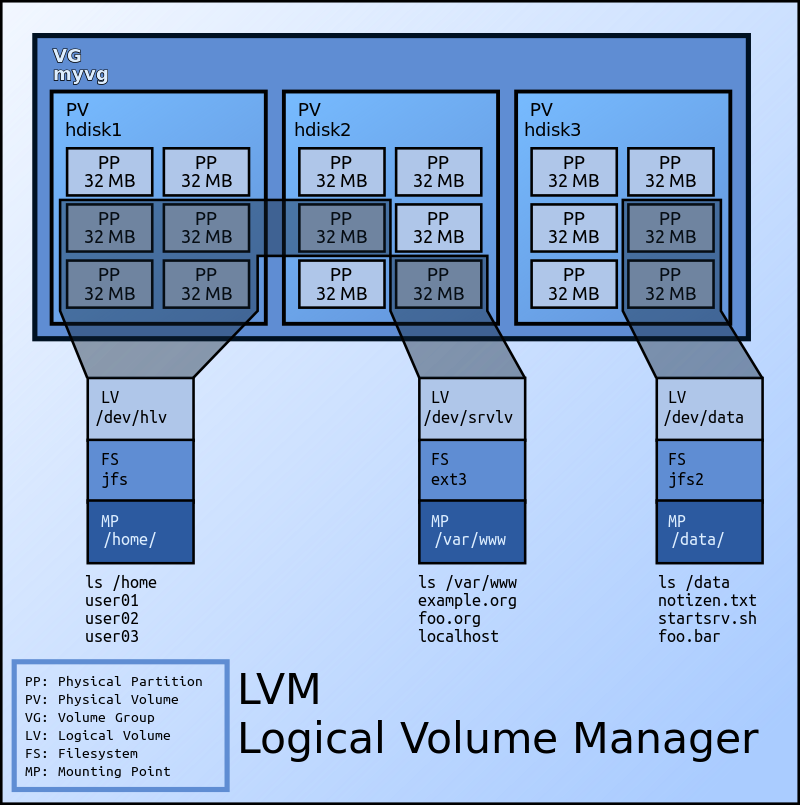

# 文件系统
本节记录 Linux 操作系统中的文件系统相关概念和操作。

## 利用fdisk对硬盘重新分区
fdisk是操作硬盘分区表的工具。输入`fdisk /dev/vda`以对该硬盘进行分区操作.输出为：

```
[root@virt2 ~]# fdisk /dev/vda
Welcome to fdisk (util-linux 2.23.2).

Changes will remain in memory only, until you decide to write them.
Be careful before using the write command.


Command (m for help): m
Command action
   a   toggle a bootable flag
   b   edit bsd disklabel
   c   toggle the dos compatibility flag
   d   delete a partition
   g   create a new empty GPT partition table
   G   create an IRIX (SGI) partition table
   l   list known partition types
   m   print this menu
   n   add a new partition
   o   create a new empty DOS partition table
   p   print the partition table
   q   quit without saving changes
   s   create a new empty Sun disklabel
   t   change a partition's system id
   u   change display/entry units
   v   verify the partition table
   w   write table to disk and exit
   x   extra functionality (experts only)
```
在输入m后得到了操作表。首先我们输入p以查看当前的分区表。

```
Command (m for help): p

Disk /dev/vda: 214.7 GB, 214748364800 bytes, 419430400 sectors
Units = sectors of 1 * 512 = 512 bytes
Sector size (logical/physical): 512 bytes / 512 bytes
I/O size (minimum/optimal): 512 bytes / 512 bytes
Disk label type: dos
Disk identifier: 0x000c411d

   Device Boot      Start         End      Blocks   Id  System
/dev/vda1   *        2048    62916607    31457280   83  Linux
/dev/vda2        62916608    67108863     2096128   82  Linux swap / Solaris

Command (m for help):
```
在这里我们发现问题：
硬盘容量有 214.7GB，但是分区1仅仅使用 30GB，分区2仅仅使用 2GB，也就是说还有很大一部分的硬盘容量没有利用起来。于是这里我们需要对硬盘重新分区。

首先使用d命令删除当前的两个分区表

```
Command (m for help): d
Partition number (1,2, default 2):
Partition 2 is deleted

Command (m for help): d
Selected partition 1
Partition 1 is deleted

Command (m for help):
```
然后使用n命令新建两个分区表。与之前一样，一个用来当启动分区，一个用于交换。由于一共有200G空间，我决定给启动分区184G的空间，交换分区16G的空间。关于交换分区的大小，可以参考[此文档](https://www.tldp.org/HOWTO/Partition/requirements.html#SwapSize).

分区1创建过程如下：

```
Command (m for help): n
Partition type:
   p   primary (0 primary, 0 extended, 4 free)
   e   extended
Select (default p): p
Partition number (1-4, default 1): 1
First sector (2048-419430399, default 2048):
Using default value 2048
Last sector, +sectors or +size{K,M,G} (2048-419430399, default 419430399): +184G
Partition 1 of type Linux and of size 184 GiB is set

```
其中的技巧是使用`+184G`来指定分区大小，从而让fdisk为我们计算结束扇区。

分区二创建过程如下：

```
Command (m for help): n
Partition type:
   p   primary (1 primary, 0 extended, 3 free)
   e   extended
Select (default p): p
Partition number (2-4, default 2): 2
First sector (385878016-419430399, default 385878016):
Using default value 385878016
Last sector, +sectors or +size{K,M,G} (385878016-419430399, default 419430399):
Using default value 419430399
Partition 2 of type Linux and of size 16 GiB is set
```
其中无需更改扇区结束处，因为fdisk默认会使用所有未分配的容量。

同时，因为此分区用于交换，我们需要修改改分区的system ID。

输入t后，指定分区2，然后可以输入L来显示所有的ID以供参考。我们可以看到82代表了Linux Swap。所以我们将其修改为82. 过程如下：

```
Command (m for help): t
Partition number (1,2, default 2): 2
Hex code (type L to list all codes): L

 0  Empty           24  NEC DOS         81  Minix / old Lin bf  Solaris
 1  FAT12           27  Hidden NTFS Win 82  Linux swap / So c1  DRDOS/sec (FAT-
 2  XENIX root      39  Plan 9          83  Linux           c4  DRDOS/sec (FAT-
 3  XENIX usr       3c  PartitionMagic  84  OS/2 hidden C:  c6  DRDOS/sec (FAT-
 4  FAT16 <32M      40  Venix 80286     85  Linux extended  c7  Syrinx
 5  Extended        41  PPC PReP Boot   86  NTFS volume set da  Non-FS data
 6  FAT16           42  SFS             87  NTFS volume set db  CP/M / CTOS / .
 7  HPFS/NTFS/exFAT 4d  QNX4.x          88  Linux plaintext de  Dell Utility
 8  AIX             4e  QNX4.x 2nd part 8e  Linux LVM       df  BootIt
 9  AIX bootable    4f  QNX4.x 3rd part 93  Amoeba          e1  DOS access
 a  OS/2 Boot Manag 50  OnTrack DM      94  Amoeba BBT      e3  DOS R/O
 b  W95 FAT32       51  OnTrack DM6 Aux 9f  BSD/OS          e4  SpeedStor
 c  W95 FAT32 (LBA) 52  CP/M            a0  IBM Thinkpad hi eb  BeOS fs
 e  W95 FAT16 (LBA) 53  OnTrack DM6 Aux a5  FreeBSD         ee  GPT
 f  W95 Ext'd (LBA) 54  OnTrackDM6      a6  OpenBSD         ef  EFI (FAT-12/16/
10  OPUS            55  EZ-Drive        a7  NeXTSTEP        f0  Linux/PA-RISC b
11  Hidden FAT12    56  Golden Bow      a8  Darwin UFS      f1  SpeedStor
12  Compaq diagnost 5c  Priam Edisk     a9  NetBSD          f4  SpeedStor
14  Hidden FAT16 <3 61  SpeedStor       ab  Darwin boot     f2  DOS secondary
16  Hidden FAT16    63  GNU HURD or Sys af  HFS / HFS+      fb  VMware VMFS
17  Hidden HPFS/NTF 64  Novell Netware  b7  BSDI fs         fc  VMware VMKCORE
18  AST SmartSleep  65  Novell Netware  b8  BSDI swap       fd  Linux raid auto
1b  Hidden W95 FAT3 70  DiskSecure Mult bb  Boot Wizard hid fe  LANstep
1c  Hidden W95 FAT3 75  PC/IX           be  Solaris boot    ff  BBT
1e  Hidden W95 FAT1 80  Old Minix
Hex code (type L to list all codes): 82
Changed type of partition 'Linux' to 'Linux swap / Solaris'
```

到这里分区的删除、重新创建就已经结束了。最后一定要注意使用w命令将其写入硬盘，否则所有的修改都是无效的。

```
Command (m for help): w
The partition table has been altered!

Calling ioctl() to re-read partition table.

WARNING: Re-reading the partition table failed with error 16: Device or resource busy.
The kernel still uses the old table. The new table will be used at
the next reboot or after you run partprobe(8) or kpartx(8)
Syncing disks.
```
最后`sudo reboot`重启机器，以应用新的分区表。

重启后使用`fdisk -l`命令发现，新的分区表已经生成成功。

```
[root@virt2 ~]# fdisk -l

Disk /dev/vda: 214.7 GB, 214748364800 bytes, 419430400 sectors
Units = sectors of 1 * 512 = 512 bytes
Sector size (logical/physical): 512 bytes / 512 bytes
I/O size (minimum/optimal): 512 bytes / 512 bytes
Disk label type: dos
Disk identifier: 0x000c411d

   Device Boot      Start         End      Blocks   Id  System
/dev/vda1            2048   385878015   192937984   83  Linux
/dev/vda2       385878016   419430399    16776192   82  Linux swap / Solaris
```

## 扩大文件系统
对硬盘重新分区后，使用`df -hT` 查看文件系统时，发现事情没有这么简单...

```
[root@virt2 ~]# df -hT
Filesystem     Type      Size  Used Avail Use% Mounted on
/dev/vda1      ext4       30G  1.5G   27G   6% /
devtmpfs       devtmpfs   16G     0   16G   0% /dev
tmpfs          tmpfs      16G     0   16G   0% /dev/shm
tmpfs          tmpfs      16G  8.6M   16G   1% /run
tmpfs          tmpfs      16G     0   16G   0% /sys/fs/cgroup
tmpfs          tmpfs     3.2G     0  3.2G   0% /run/user/0
```
在这里，/dev/vda1分区的容量还是只有30G. 这是因为改变的是分区大小，而其对应的文件系统不会自动改变容量，需要继续进行相关操作来扩大文件系统的容量。

在网上搜集相关资料后，发现一个相关命令`resize2fs`. 通过`man resize2fs`命令发现了一段关键信息：

```
If you wish to enlarge a filesystem, you must make sure you can expand the  size of  the  underlying partition first. 
This can be done using fdisk(8) by deleting the partition and recreating it with a larger size or using lvex-tend(8), 
if you're using the logical volume manager lvm(8).  
When recreating the partition, make sure you create it with  the  same  starting  disk cylinder as before!
Otherwise, the resize operation will certainly not work, and you may lose your entire filesystem. 
After running fdisk(8),run resize2fs to resize the ext2 filesystem to use all of the space in the newly enlarged partition.
```
这里说的意思是：如果你想要扩大文件系统的容量，首先需要确保你可以扩大其对应的磁盘分区容量.（可以使用`fdisk`命令来删除并重新创建分区；而如果你使用lvm的话，需要使用`lvextend`命令）。
然后，对于 `ext2/3/4` 类型的文件系统，可以使用 `resize2fs`来改变文件系统容量。

所以我输入命令 `resize2fs /dev/vda1` 成功得扩大了文件系统容量。

```
[root@virt2 ~]# resize2fs /dev/vda1
resize2fs 1.42.9 (28-Dec-2013)
Filesystem at /dev/vda1 is mounted on /; on-line resizing required
old_desc_blocks = 4, new_desc_blocks = 23
The filesystem on /dev/vda1 is now 48234496 blocks long.

```
然后用 `df -hT`来查看文件系统

```
[root@virt2 ~]# df -hT
Filesystem     Type      Size  Used Avail Use% Mounted on
/dev/vda1      ext4      181G  1.5G  172G   1% /
devtmpfs       devtmpfs   16G     0   16G   0% /dev
tmpfs          tmpfs      16G     0   16G   0% /dev/shm
tmpfs          tmpfs      16G  8.6M   16G   1% /run
tmpfs          tmpfs      16G     0   16G   0% /sys/fs/cgroup
tmpfs          tmpfs     3.2G     0  3.2G   0% /run/user/0
```
发现已经成功扩容。

最后使用`mkswap /dev/vda2 && swapon /dev/vda2` 使用swap交换。

## LVM (Logical Volume Manager)
LVM是 逻辑卷管理（Logical Volume Manager）的简写，它是 Linux 环境下对磁盘分区管理的一种机制。

在以上系统中，文件系统（File System）直接建立于硬盘分区（Partition）上。而这种方式下，由于硬盘分区在确定后很难更改大小，所以文件系统的大小也很难在运行时改变大小（尤其是减小）。如果在使用过程中发现文件系统容量不够，需要随机应变时，这种简单的磁盘分区管理机制就无法满足要求了。

因此完美地解决方法应该是在零停机前提下可以自如地对文件系统对大小进行调整，可以方便地实现文件系统跨越不同磁盘和分区。LVM机制就是这样一种方案。

LVM本质上是一个虚拟设备驱动，是在内核中块设备和物理设备之间添加的一个新的抽象层次，如图所示。


* PV（Physical Volume)：物理卷，处于LVM的最底层，可以是硬盘分区、整个硬盘、元设备或者回送文件(loopback file)。
* VG（Volume Group)：卷组，建立在PV之上，可以含有一个到多个PV。
* LV（Logical Volume）：逻辑卷，建立在VG之上，相当于原来分区的概念。优点是灵活，大小可以动态改变，并且不需要在物理上连续，甚至可以跨硬盘。

使用LVM的基本步骤如下：
1. 如果有必要的话，安装新的硬盘。
2. 选做：为硬盘进行分区。
3. 使用`pvcreate`命令将硬盘或者分区创建成为LVM管理的物理卷。
4. 使用`vgcreate`创建新的卷组或者使用`vgextend`将PV加入现有的卷组。
5. 使用`lvcreate`在VG上创建新的逻辑卷。
6. 使用`mkfs`在逻辑卷上创建新的文件系统。
7. 在`/etc/fstab`中写入相应条目，将文件系统 mount 在合适的目录下。
8. mount 文件系统。

### 举例
假设现在安装了一块新的硬盘`/dev/hdd`，可以通过以下操作创建新的文件系统。
```bash
# create new PV from hard drive.
pvcreate /dev/hdd
# add PV to existing volume group
vgextend /dev/MyVG01 /dev/hdd
# create a logical volume
lvcreate -L 50G --name Stuff MyVG01
# create a file system
mkfs -t ext4 /dev/MyVG01/Stuff
# add a file system label
e2label /dev/MyVG01/Stuff Stuff
# mount the file system
# add an apporiate entry to /etc/fstab 
# use df, lvs, vgs to check.
```

假设想要为文件系统扩容，在为VG添加了PV后：
```bash
# extend the logical volume
lvextend -L 50G /dev/MyVG01/Stuff
# expand teh file system
resize2fs /dev/MyVG01/Stuff
# check 
df -hT
```

### 对学院服务器进行文件系统扩缩容
学院服务器使用 LVM 对磁盘进行管理。使用 `lvdisplay` 查看其逻辑卷情况，发现有三个逻辑卷，主要的两个是 `/dev/centos/home` 和 `/dev/centos/root/`。
```bash
$ lvdisplay
  --- Logical volume ---
  LV Path                /dev/centos/swap
  LV Name                swap
  VG Name                centos
  LV UUID                rJR3Jb-5uhg-Bk0m-Mylv-4fhs-N00U-TCX6kQ
  LV Write Access        read/write
  LV Creation host, time localhost.localdomain, 2016-08-09 22:22:00 -0400
  LV Status              available
  # open                 2
  LV Size                2.00 GiB
  Current LE             512
  Segments               1
  Allocation             inherit
  Read ahead sectors     auto
  - currently set to     8192
  Block device           253:1
   
  --- Logical volume ---
  LV Path                /dev/centos/home
  LV Name                home
  VG Name                centos
  LV UUID                Nj18L4-51Lz-d2n8-pAJP-4OBz-rWke-yc5VcZ
  LV Write Access        read/write
  LV Creation host, time localhost.localdomain, 2016-08-09 22:22:00 -0400
  LV Status              available
  # open                 1
  LV Size                47.45 GiB
  Current LE             12146
  Segments               1
  Allocation             inherit
  Read ahead sectors     auto
  - currently set to     8192
  Block device           253:2
   
  --- Logical volume ---
  LV Path                /dev/centos/root
  LV Name                root
  VG Name                centos
  LV UUID                w7RY5D-luT1-RZXj-iyjb-0c7B-uD3z-64FJLO
  LV Write Access        read/write
  LV Creation host, time localhost.localdomain, 2016-08-09 22:22:02 -0400
  LV Status              available
  # open                 1
  LV Size                50.00 GiB
  Current LE             12800
  Segments               1
  Allocation             inherit
  Read ahead sectors     auto
  - currently set to     8192
  Block device           253:0
```

然后，查看一下文件系统：
```bash
$ df -hT
Filesystem              Type      Size  Used Avail Use% Mounted on
/dev/mapper/centos-root xfs        50G  1.1G   49G   3% /
devtmpfs                devtmpfs   12G     0   12G   0% /dev
tmpfs                   tmpfs      12G     0   12G   0% /dev/shm
tmpfs                   tmpfs      12G  1.1G   11G   9% /run
tmpfs                   tmpfs      12G     0   12G   0% /sys/fs/cgroup
/dev/mapper/centos-home xfs        48G   33M   48G   1% /home
/dev/sda1               xfs       497M  123M  375M  25% /boot
tmpfs                   tmpfs     2.4G     0  2.4G   0% /run/user/0
```

发现：
* `/dev/mapper/centos-root` 挂载的是根目录，即我们常用的基本都放在这里了
* `/dev/mapper/contos-home` 挂载的是 `/home` 目录，平时用的比较少

而两个文件系统都是给的 50G 左右的大小，所以比较浪费，我们需要给 root 分配更多，而给 home 分配少一点即可。

由于 xfs 文件系统只能扩，不能缩，所以我们首先把 home 删掉。（如果需要收缩的文件系统很大且很重要，那么请谨慎使用该方法）。

0. 备份
```bash
$ xfsdump -f /root/home.img /home
```

1. 卸载 home 目录
```bash
umount /home
```

如果无法卸载报错 `umount: /home: device is busy`
那么必须用fuser命令来查看process ID和进程的拥有者，比如:
```bash
[root@yc ~]# fuser -cu /home/
/home:                1849rce(yinchong)  1861rce(yinchong)  
[root@yc ~]#
```

然后使用 `fuser -ck /home/` 可以 kill 相关进程。

2. 删除相关逻辑卷
```bash
$ lvremove /dev/centos/home
```

3. 扩展 root 逻辑卷 与 文件系统根目录
```bash
$ lvresize -L 90G /dev/centos/root  # 扩展逻辑卷
$ xfs_growfs /dev/centos/root  # 扩展文件系统
```

4. 重建 home 逻辑卷 和 文件系统
```bash
$ lvcreate -L 5G -n home centos    # 重建逻辑卷
$ mkfs.xfs /dev/mapper/centos-home  # 格式化 home 文件系统
$ mount -a # 挂载。由于本文中 lv 名称 和 挂载点都不变，所以不需要修改 /etc/fstab
```

5. 恢复备份
```
$ xfsrestore -f home.img /home
```