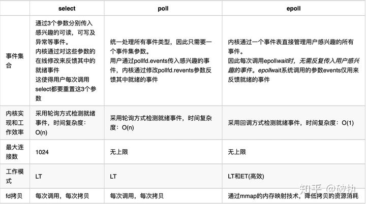

# IO (epoll)

## select，poll 和 epoll

下面简单介绍一下操作系统中的几个与 IO多路复用有关的系统调用（Linux 中的 epoll），以及与之相关的 select 和 poll。
> 注意，这里的 select 指的是操作系统里的 select，而不是 Java NIO 中的 select，一定不要搞混淆。

### 1. select
Linux 系统中 `/usr/include/sys/select.h` 中对 select 方法的定义如下：
```c
/* fd_set for select and pselect.  */
typedef struct
  { 
    /* XPG4.2 requires this member name.  Otherwise avoid the name
       from the global namespace.  */
    #ifdef __USE_XOPEN
        __fd_mask fds_bits[__FD_SETSIZE / __NFDBITS];
    # define __FDS_BITS(set) ((set)->fds_bits)
    #else
        __fd_mask __fds_bits[__FD_SETSIZE / __NFDBITS];
    # define __FDS_BITS(set) ((set)->__fds_bits)
    #endif
  } fd_set;

/* Check the first NFDS descriptors each in READFDS (if not NULL) for read
   readiness, in WRITEFDS (if not NULL) for write readiness, and in EXCEPTFDS
   (if not NULL) for exceptional conditions.  If TIMEOUT is not NULL, time out
   after waiting the interval specified therein.  Returns the number of ready
   descriptors, or -1 for errors.

   This function is a cancellation point and therefore not marked with
   __THROW.  */
extern int select (int __nfds, fd_set *__restrict __readfds,
                   fd_set *__restrict __writefds,
                   fd_set *__restrict __exceptfds,
                   struct timeval *__restrict __timeout);
```
运行机制：select 会将 fd_set 从用户空间拷贝到内核空间，并注册回调函数，在内核态空间来判断每个请求是否准备好数据。select 在没有查询到有文件描述符就绪的情况下，将一直阻塞（select 是一个阻塞函数）。如果有一个或者多个描述符就绪，那么 select 将就绪的文件描述符置位，然后 select 返回。返回后，由程序遍历查看哪个请求有数据。

select 的缺陷：
* 每次调用 select，都需要把fd集合从用户态拷贝到内核态，fd越多开销则越大。
* 每次调用 select 都需要在内核遍历传递进来的所有 fd，这个开销在 fd 很多时也很大。也就是说，select 对 socket 是线性扫描，即轮询，效率较低：仅知道有I/O事件发生，却不知是哪几个流，只会无差异轮询所有流，找出能读数据或写数据的流进行操作。同时处理的流越多，无差别轮询时间越长 - O(n)。
* select支持的文件描述符数量有限，默认是1024。

### 2. poll
Linux 系统中在 `/usr/include/sys/poll.h` 中对 poll 方法定义如下：
```c
/* Data structure describing a polling request.  */
struct pollfd
  {
    int fd;                     /* File descriptor to poll.  */
    short int events;           /* Types of events poller cares about.  */
    short int revents;          /* Types of events that actually occurred.  */
  };

/* Poll the file descriptors described by the NFDS structures starting at
   FDS.  If TIMEOUT is nonzero and not -1, allow TIMEOUT milliseconds for
   an event to occur; if TIMEOUT is -1, block until an event occurs.
   Returns the number of file descriptors with events, zero if timed out,
   or -1 for errors.

   This function is a cancellation point and therefore not marked with
   __THROW.  */
extern int poll (struct pollfd *__fds, nfds_t __nfds, int __timeout);
```
运行机制：poll 的实现和 select 非常相似，只是描述 fd 集合的方式不同，poll 使用 pollfd 结构代替 select 的 fd_set（网上讲：类似于位图）结构，其他的本质上都差不多。所以 Poll 机制突破了 Select 机制中的文件描述符数量最大为 1024 的限制。

相对于 select，poll 解决了文件描述符上限为 1024 的缺陷，但是另外两个缺点仍然存在：
1. 每次调用 poll，都需要把 fd 集合从用户态拷贝到内核态，fd 越多开销则越大；
2. 每次调用 poll，都需要在内核遍历传递进来的所有 fd，这个开销在 fd 很多时也很大

### 3. epoll
epoll 在 Linux 2.6 正式提出，是基于事件驱动的 IO 方式。相对于 select 来说，epoll 没有文件描述符个数限制：其使用一个文件描述符来管理多个文件描述符，也就是说，将用户关心的文件描述符的事件存放到内核的一个事件表中，通过内存映射，使其在用户空间也可直接访问，省去了拷贝带来的资源消耗。

Linux 系统中在 `/usr/include/sys/epoll.h` 中定义了 epoll：
```c
/* Creates an epoll instance.  Returns an fd for the new instance.
   The "size" parameter is a hint specifying the number of file
   descriptors to be associated with the new instance.  The fd
   returned by epoll_create() should be closed with close().  */
extern int epoll_create (int __size) __THROW;

/* Manipulate an epoll instance "epfd". Returns 0 in case of success,
   -1 in case of error ( the "errno" variable will contain the
   specific error code ) The "op" parameter is one of the EPOLL_CTL_*
   constants defined above. The "fd" parameter is the target of the
   operation. The "event" parameter describes which events the caller
   is interested in and any associated user data.  */
extern int epoll_ctl (int __epfd, int __op, int __fd,
                      struct epoll_event *__event) __THROW;

/* Wait for events on an epoll instance "epfd". Returns the number of
   triggered events returned in "events" buffer. Or -1 in case of
   error with the "errno" variable set to the specific error code. The
   "events" parameter is a buffer that will contain triggered
   events. The "maxevents" is the maximum number of events to be
   returned ( usually size of "events" ). The "timeout" parameter
   specifies the maximum wait time in milliseconds (-1 == infinite).

   This function is a cancellation point and therefore not marked with
   __THROW.  */
extern int epoll_wait (int __epfd, struct epoll_event *__events,
                       int __maxevents, int __timeout);
```
可以看到其中有三个函数：
* `epoll_create`：创建一个 epoll 实例并返回，该实例可以用于监控 _size 个文件描述符。
* `epoll_ctl`：向 epoll 中注册事件，该函数如果调用成功则返回 0，否则返回 -1.
    * `__epfd` 为 `epoll_create` 返回的 epoll 实例
    * `__op` 表示要进行的操作
    * `__fd` 为要进行监控的文件描述符
    * `__event` 为要监控的事件
* `epoll_wait`：类似于 select 机制中的 select 函数，poll 机制中的 poll 函数，等待内核返回监听描述符的事件产生。该函数返回已经就绪的事件数量，如果为 -1 表示出错。
    * `__epfd` 为 `epoll_create` 返回的 epoll 实例
    * `__events` 数组为 epoll_wait要返回的已经产生的事件集合
    * `__maxevents` 为希望返回的最大的事件数量（通常为 __events 的大小）
    * `__timeout` 和 select，poll 中相同

运行机制：epoll 操作过程需要上述三个函数，也正是通过三个函数完成 Select 机制中一个函数完成的事情，解决了 Select 机制的三大缺陷。epoll 的工作机制更为复杂，我们就解释一下，它是如何解决 Select 机制的三大缺陷的。

1. 对于第一个缺点，epoll 的解决方案是：它的 fd 是共享在用户态和内核态之间的，所以可以不必进行从用户态到内核态的一个拷贝，大大节约系统资源。至于如何做到用户态和内核态，大家可以查一下 `mmap`，它是一种内存映射的方法。
2. 对于第二个缺点，epoll 的解决方案不像 select 或 poll 一样每次都把当前线程轮流加入 fd 对应的设备等待队列中，而只在 epoll_ctl 时把当前线程挂一遍（这一遍必不可少），并为每个 fd 指定一个回调函数。当设备就绪，唤醒等待队列上的等待者时，就会调用这个回调函数，而这个回调函数会把就绪的 fd 加入一个就绪链表。那么当我们调用 epoll_wait 时，epoll_wait 只需要检查链表中是否有存在就绪的 fd 即可，效率非常可观。
3. 对于第三个缺点，fd 数量的限制，也只有 Select 存在，Poll 和 Epoll都不存在。由于 Epoll 机制中只关心就绪的 fd，它相较于 Poll 需要关心所有 fd，在连接较多的场景下，效率更高。在 1GB 内存的机器上大约是 10 万左右，一般来说这个数目和系统内存关系很大。

#### epoll 的两种触发模式
epoll 有 LT（水平触发）和 ET（边缘触发）两种触发模式，其中 LT 是默认的模式，ET 是“高速”模式。

* LT（水平触发）：只要某个 socket 可读/可写，`epoll_wait` 都会将描述符返回。即只要套接字的接收缓冲中尚有数据或发送缓冲有空间容纳要发送的数据，这个套接字都会被 `epoll_wait` 返回。LT是缺省的工作方式，并且同时支持 block 和 no-block socket 。
* ET（边缘触发）：当 socket 的缓冲状态发生变化时返回。对于读缓冲，有新到达的数据被添加到读缓冲时触发；对于写缓冲，当缓冲发生容量变更的时候触发（对端确认分组，内核删除已经确认的分组，空出空间，写缓冲容量发生变更）。ET 只支持no-block socket

如果采用 LT 模式的话，系统中一旦有大量你不需要读写的就绪文件描述符，它们每次调用epoll_wait都会返回，这样会大大降低处理程序检索自己关心的就绪文件描述符的效率.。而采用EPOLLET这种边缘触发模式的话，当被监控的文件描述符上有可读写事件发生时，epoll_wait()会通知处理程序去读写。如果这次没有把数据全部读写完(如读写缓冲区太小)，那么下次调用epoll_wait()时，它不会通知你，也就是它只会通知你一次，直到该文件描述符上出现第二次可读写事件才会通知你！！！这种模式比水平触发效率高，系统不会充斥大量你不关心的就绪文件描述符。


下面是三个模式的对比图：
